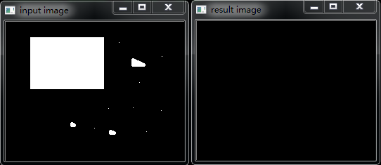
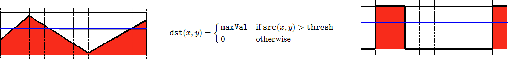
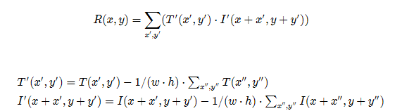

OpenCV学习]()

[TOC]


## 一安装及配置

### 1配置环境变量

在环境变量中添加  D:\opencv\build\x64\vc15\bin

### 2添加include库

新建vs工程->选中工程->视图->其他窗口->属性管理器->debug|64(右侧窗口)->右键选择Microsoft.cpp.x64.user”属性->VC++目录->包含目录->


库目录->


**注意：vs2017需要导入的是VC15**

链接器->输入->

## 二基础知识

### 1加载修改保存图像

#### (1)加载图像

**imread**功能是加载图像文件成为一个**Mat**对象，其中第一个参数表示图像文件名称

第二个参数，表示加载的图像是什么类型，支持常见的三个参数值

lIMREAD_UNCHANGED (<0) 表示加载原图，不做任何改变

lIMREAD_GRAYSCALE ( 0)表示把原图作为灰度图像加载进来

lIMREAD_COLOR (>0) 表示把原图作为RGB图像加载进来

**注意：**OpenCV支持JPG、PNG、TIFF等常见格式图像文件加载

#### (2)显示图像**(cv::**namedWindos与cv::imshow)

namedWindos功能是创建一个OpenCV窗口，它是由OpenCV自动创建与释放，你无需取销毁它。

常见用法namedWindow("Window Title", WINDOW_AUTOSIZE)

WINDOW_AUTOSIZE会自动根据图像大小，显示窗口大小，不能人为改变窗口大小

WINDOW_NORMAL,跟QT集成的时候会使用，允许修改窗口大小。

imshow根据窗口名称显示图像到指定的窗口上去，第一个参数是窗口名称，第二参数是Mat对象

```c++
#include<opencv2/opencv.hpp>
#include<iostream>
#include<math.h>
using namespace cv;
int main(int argc, char** argv)
{
	Mat src = imread("D:/Visual Studio/workspace/image/test.jpg");
	if (src.empty()) {
		printf("could not load image");
		return -1;
	}
	namedWindow("load image", CV_WINDOW_AUTOSIZE);
	imshow("load image", src);
	waitKey(0);
	return 0;
}
```

#### (3)修改图像(cv::cvtColor)

cvtColor的功能是把图像从一个彩色空间转换到另外一个色彩空间，有三个参数，第一个参数表示源图像、第二参数表示色彩空间转换之后的图像、第三个参数表示源和目标色彩空间如：COLOR_BGR2HLS 、COLOR_BGR2GRAY 等
cvtColor( image, gray_image, COLOR_BGR2GRAY );

```c++
#include<opencv2/opencv.hpp>
#include<iostream>
#include<math.h>
using namespace cv;
int main(int argc, char** argv)
{
	Mat src = imread("D:/Visual Studio/workspace/image/mogu.jpg", IMREAD_COLOR);
	if (src.empty()) {
		printf("could not load image");
		return -1;
	}
	namedWindow("cvtcolr image", CV_WINDOW_AUTOSIZE);
	Mat output;
	cvtColor(src, output, CV_BGR2HSV);
	imshow("cvtcolr image", output);
	waitKey(0);
	return 0;
}
```

#### (4)保存图像(cv::imwrite)

保存图像文件到指定目录路径
只有8位、16位的PNG、JPG、Tiff文件格式而且是单通道或者三通道的BGR的图像才可以通过这种方式保存
保存PNG格式的时候可以保存透明通道的图片
可以指定压缩参数

```c++
#include<opencv2/opencv.hpp>
#include<iostream>
#include<math.h>
using namespace cv;
int main(int argc, char** argv)
{
	Mat src = imread("D:/Visual Studio/workspace/image/mogu.jpg", IMREAD_COLOR);
	if (src.empty()) {
		printf("could not load image");
		return -1;
	}
	namedWindow("cvtcolr image", CV_WINDOW_AUTOSIZE);
	Mat output;
	cvtColor(src, output, CV_BGR2HSV);
	imshow("cvtcolr image", output);
	imwrite("D:/Visual Studio/workspace/image/mogu_hsv.png",output);
	waitKey(0);
	return 0;
}
```

### 2矩阵的掩膜操作

#### （1）获取图像像素指针

​	CV_Assert(myImage.depth() == CV_8U); 
​	Mat.ptr<uchar>(int i=0) 获取像素矩阵的指针，索引i表示第几行，从0开始计行数。
​	获得当前行指针const uchar*  current= myImage.ptr<uchar>(row );
​	获取当前像素点P(row, col)的像素值 p(row, col) =current[col]

#### （2）像素范围处理saturate_cast<uchar>

​	saturate_cast<uchar>（-100），返回 0。

​	saturate_cast<uchar>（288），返回255
​	saturate_cast<uchar>（100），返回100
​	这个函数的功能是确保RGB值得范围在0~255之间

#### （3)  掩膜操作实现图像对比度调整

​	红色是中心像素，从上到下，从左到右对每个像素做同样的处理操作，得到最终结果就是对比度提高之后的输出图像Mat对象


​	

```c++
#include<opencv2/opencv.hpp>
#include<math.h>
using namespace std;
using namespace cv;
int main(int argc, char** argv)
{
	Mat src, dst;
	src = imread("D:/Visual Studio/workspace/image/test.jpg");
	if (!src.data)
	{
		printf("could not load images");
		return -1;
	}
	namedWindow("input image", CV_WINDOW_AUTOSIZE);
	imshow("input image", src);
	dst = Mat::zeros(src.size(), src.type());

	/*
	int rows = (src.rows-1);
	int cols = (src.cols-1)*src.channels();
	int offsetx = src.channels();
	

	for (int row = 1; row <rows; row++)
	{
		const uchar* pervious = src.ptr<uchar>(row-1);
		const uchar* current  = src.ptr<uchar>(row);
		const uchar* next = src.ptr<uchar>(row + 1);
		uchar* output = dst.ptr<uchar>(row);
		for (int col = offsetx; col < cols; col++)
		{
			output[col] = saturate_cast<uchar>(5*current[col]-(current[col-offsetx]+current[col+offsetx]+pervious[col]+next[col]));
		}
	}*/
	Mat kernel = (Mat_<char>(3, 3) << 0, -1, 0, -1, 5, -1, 0, -1, 0);
	filter2D(src, dst, src.depth(), kernel);

	namedWindow("output image", CV_WINDOW_AUTOSIZE);
	imshow("output image", dst);
	waitKey(0);
}
```

### 3Mat对象

#### （1）Mat对象与IplImage对象

**Mat**对象OpenCV2.0之后引进的图像数据结构、自动分配内存、不存在内存泄漏的问题，是面向对象的数据结构。分了两个部分，头部与数据部分

**IplImage**是从2001年OpenCV发布之后就一直存在，是C语言风格的数据结构，需要开发者自己分配与管理内存，对大的程序使用它容易导致内存泄漏问题

#### （2）构造函数、常用方法

```c++
常用方法：

void copyTo(Mat mat)
void convertTo(Mat dst, int type)//完全的数据拷贝
Mat clone()//完全的数据拷贝
int channels()//查看数据通道数目
int depth()
bool empty();
uchar* ptr(i=0)

```

构造函数


```c++
#include<opencv2/opencv.hpp>
#include<iostream>
using namespace  std;
using namespace cv;

int main(int argc, char** arcv)
{
	Mat src;
	src = imread("D:/Visual Studio/workspace/image/test.jpg");
	if (src.empty())
	{
		printf("could not load image");
		return -1;
	}
	namedWindow("src image", CV_WINDOW_AUTOSIZE);
	imshow("src image", src);
	Mat dst1,dst2;
	/*dst1 = Mat(src.size(), src.type());
	dst = Scalar(0,255,0);//BGR
	namedWindow("output image", CV_WINDOW_AUTOSIZE);
	imshow("output image", dst);*/
	dst1 = src.clone();
	dst1.copyTo(dst2);
	namedWindow("output1 image", CV_WINDOW_AUTOSIZE);
	imshow("output1 image", dst1);
	namedWindow("output2 image", CV_WINDOW_AUTOSIZE);
	imshow("output2 image", dst2);
	Mat dst_gray;
	cvtColor(src,dst_gray,CV_BGR2GRAY);
	namedWindow("gray image", CV_WINDOW_AUTOSIZE);
	imshow("gray image", dst_gray);
	printf("src image channel is: %d\n", src.channels());
	printf("dst image channel is: %d\n", dst_gray.channels());
	const uchar*firstRow= dst_gray.ptr<uchar>(0);
	printf("first pixel vuue : %d\n", *firstRow);
	int p_row = dst_gray.rows;
	int p_col = dst_gray.cols;
	printf("dst image rows is: %d\n", p_row);
	printf("dst image cols is: %d\n", p_col);
    Mat M(3,3, CV_8UC3, Scalar(0, 0, 255));
	cout << M << endl;
	waitKey(0);
}
```

#### （3）Mat对象使用

部分复制：一般情况下只会复制Mat对象的头和指针部分，不会复制数据部分Mat A= imread(imgFilePath);
Mat B(A)  // 只复制
完全复制：如果想把Mat对象的头部和数据部分一起复制，可以通过如下两个API实现Mat F = A.clone(); 或 Mat G; A.copyTo(G);

#### （4）Mat对象使用-四个要点

输出图像的内存是自动分配的
使用OpenCV的C++接口，不需要考虑内存分配问题
赋值操作和拷贝构造函数只会复制头部分
使用clone与copyTo两个函数实现数据完全复制

#### （5）Mat对象创建

cv::Mat::Mat构造函数
Mat M(2,2,CV_8UC3, Scalar(0,0,255))
其中前两个参数分别表示行(row)跟列(column)、第三个CV_8UC3中的8表示每个通道占8位、U表示无符号、C表示Char类型、3表示通道数目是3，第四个参数是向量表示初始化每个像素值是多少，向量长度对应通道数目一致创建多维数组cv::Mat::create
		 	int sz[3] = {2,2,2};     
			Mat  L(3,sz, CV_8UC1, Scalar::all(0));

```c++
Mat M;
M.create(4, 3, CV_8UC2);
M = Scalar(127,127);
cout << "M = " << endl << " " << M << endl << endl;
uchar* firstRow = M.ptr<uchar>(0);
printf("%d", *firstRow);

```

#### （6）定义小数组

```c++
Mat C = (Mat_<double>(3,3) << 0, -1, 0, -1, 5, -1, 0, -1, 0);     
cout << "C = " << endl << " " << C << endl << endl;

```

#### （7）其他

```c++
#include<opencv2/opencv.hpp>
#include<iostream>
using namespace  std;
using namespace cv;

int main(int argc, char** arcv)
{
	Mat src;
	src = imread("D:/Visual Studio/workspace/image/test.jpg");
	if (src.empty())
	{
		printf("could not load image");
		return -1;
	}
	namedWindow("src image", CV_WINDOW_AUTOSIZE);
	imshow("src image", src);
	Mat M(3,3, CV_8UC3, Scalar(0, 0, 255));
	cout << M << endl;
	
	Mat m2 = Mat::zeros(src.size(), src.type());
	Mat m3 = Mat::zeros(2,2,CV_8UC1);
	Mat m4 = Mat::eye(10,10, CV_8UC1);
	cout << m4 << endl;
	imshow("a", m4);
	waitKey(0);

```

### 4图像操作

#### （1）读写图像

imread 可以指定加载为灰度或者RGB图像
Imwrite 保存图像文件，类型由扩展名决定

#### （2）读写修改像素

##### 读写像素值

读一个GRAY像素点的像素值（CV_8UC1）
Scalar intensity = img.at<uchar>(y, x); 
或者 Scalar intensity = img.at<uchar>(Point(x, y));

读一个RGB像素点的像素值
Vec3f intensity = img.at<Vec3f>(y, x); 
float blue = intensity.val[0]; 
float green = intensity.val[1]; 
float red = intensity.val[2];

##### 修改像素值

灰度图像
img.at<uchar>(y, x) = 128;

RGB三通道图像
img.at<Vec3b>(y,x)[0]=128; // blue
img.at<Vec3b>(y,x)[1]=128; // green
img.at<Vec3b>(y,x)[2]=128; // red

空白图像赋值
img = Scalar(0);

ROI选择
Rect r(10, 10, 100, 100); 
Mat smallImg = img(r);

##### Vec3b与Vec3F

Vec3b对应三通道的顺序是blue、green、red的uchar类型数据。
Vec3f对应三通道的float类型数据
把CV_8UC1转换到CV32F1实现如下：
src.convertTo(dst, CV_32F);

```c++
#include<opencv2/opencv.hpp>
#include<iostream>
using namespace  std;
using namespace cv;

int main(int argc, char** arcv)
{
	Mat src,gray_src;
	src = imread("D:/Visual Studio/workspace/image/dxy02.jpg");
	if (src.empty())
	{
		printf("could not load image");
		return -1;
	}
	namedWindow("src image", CV_WINDOW_AUTOSIZE);
	imshow("src image", src);
	/*
	cvtColor(src, gray_src, CV_BGR2GRAY);
	int height = gray_src.rows;
	int width = gray_src.cols;
	for (int row = 0; row < height; row++)
	{
		for (int col = 0; col < width; col++)
		{
			int gray = gray_src.at<uchar>(row, col);
			gray_src.at<uchar>(row, col) = 255 - gray;
		}
	}
	imshow("gray_invert", gray_src);
	*/
	Mat dst;
	dst.create(src.size(), src.type());
	int height = src.rows;
	int width = src.cols;
	int channel = src.channels();
	/*
	for (int row= 0; row < height; row++)
	{
		for (int col = 0; col < width; col++)
		{
			if (channel==1)
			{
				int gray = src.at<uchar>(row, col);
				dst.at<uchar>(row, col) = 255 - gray;

			}
			else
			{
				int b = src.at<Vec3b>(row, col)[0];
				int g = src.at<Vec3b>(row, col)[1];
				int r = src.at<Vec3b>(row, col)[2];
				dst.at<Vec3b>(row, col)[0] = 255 - b;
				dst.at<Vec3b>(row, col)[1] = 255 - g;
				dst.at<Vec3b>(row, col)[2] = 255 - r;
			}
		}
	}
	*/
	bitwise_not(src, dst);//位操作取反
	imshow("output image", dst);
	waitKey(0);
}
```

### 5图像混合

#### 1理论-线性混合操作

g(x)=(1-α)f0(x)+αf1 (x)   其中 α的取值范围为0~1之间

####  2相关API (addWeighted)


参数1：输入图像Mat – src1
参数2：输入图像src1的alpha值
参数3：输入图像Mat – src2
参数4：输入图像src2的alpha值
参数5：gamma值  //检验值  如果太暗加上这个值
参数6：输出混合图像

**注意点：两张图像的大小和类型必须一致才可以**

```c++
#include<opencv2/opencv.hpp>
#include<iostream>
using namespace  std;
using namespace cv;

int main(int argc, char** arcv)
{
	Mat src1,src2,dst1,dst2;
	src1 = imread("D:/Visual Studio/workspace/image/1.jpg");
	src2 = imread("D:/Visual Studio/workspace/image/2.jpg");
	if (src1.empty())
	{
		printf("could not load image1");
		return -1;
	}
	if (src2.empty())
	{
		printf("could not load image2");
		return -1;
	}
	//namedWindow("src1 image", CV_WINDOW_AUTOSIZE);
	imshow("src1 image", src1);
	imshow("src2 image", src2);
	double alpha = 0.5;
	if ((src1.rows==src2.rows)&&(src1.rows==src2.cols)&&(src1.type()==src2.type()))
	{
		addWeighted(src1,alpha,src2,(1-alpha),0.0,dst1);
		multiply(src1, src2, dst2, 1.0);
	}
	else
	{
		printf("image size is not the same");
		return -1;
	}
	imshow("dst1 image", dst1);
	imshow("dst2 image", dst2);
	waitKey(0);
}
```

### 6调整图像亮度与对比度

#### 1理论

图像变换可以看作如下：
 - 像素变换 – 点操作

 - 邻域操作 – 区域

  调整图像亮度和对比度属于像素变换-点操作

  g(i,j)=αf(i,j)+β其中α>0,β是增益变量

#### 2重要的API

Mat new_image = Mat::zeros( image.size(), image.type() );  创建一张跟原图像大小和类型一致的空白图像、像素值初始化为0

 saturate_cast<uchar>(value)确保值大小范围为0~255之间

Mat.at<Vec3b>(y,x)[index]=value 给每个像素点每个通道赋值

```c++
#include<opencv2/opencv.hpp>
#include<iostream>
using namespace  std;
using namespace cv;

int main(int argc, char** arcv)
{
	Mat src, dst;
	src = imread("D:/Visual Studio/workspace/image/dxy02.jpg");
	if (src.empty())
	{
		printf("could not load image");
		return -1;
	}

	//char input_win[] = "src image";
	//namedWindow(input_win, CV_WINDOW_AUTOSIZE);
	imshow("src image", src);
	int height = src.rows;
	int width = src.cols;
	double alpha = 1.3;
	double beta = 30;

	Mat m1;
	src.convertTo(m1, CV_32F);
	dst = Mat::zeros(src.size(), src.type());
	for (int row = 0; row < height; row++)
	{
		for (int col = 0; col < width; col++)
		{
			if (src.channels() == 3)
			{
				//uchar b = src.at<Vec3b>(row, col)[0];
				//uchar g = src.at<Vec3b>(row, col)[1];
				//uchar r = src.at<Vec3b>(row, col)[2];

				uchar b = m1.at<Vec3f>(row, col)[0];
				uchar g = m1.at<Vec3f>(row, col)[1];
				uchar r = m1.at<Vec3f>(row, col)[2];

				dst.at<Vec3b>(row, col)[0] = saturate_cast<uchar>(b*alpha + beta);
				dst.at<Vec3b>(row, col)[1] = saturate_cast<uchar>(g*alpha + beta);
				dst.at<Vec3b>(row, col)[2] = saturate_cast<uchar>(r*alpha + beta);
			}
			else if (src.channels() == 1)
			{
				float gray = src.at<uchar>(row, col);
				dst.at<uchar>(row, col) = saturate_cast<uchar>(gray*alpha + beta);
			}
		}
	}
	imshow("output image", dst);
	waitKey(0);
}
```

### 7绘制形状与文字

#### 1使用cv::Point与cv::Scalar

```c++
//Point表示2D平面上一个点x,y
	Point p;
	p.x = 10;
	p.y = 8;
 	or
	p = Pont(10,8);
//Scalar表示四个元素的向量
	Scalar(a, b, c);// a = blue, b = green, c = red表示RGB三个通道

```

#### 2绘制线、矩形、园、椭圆等基本几何形状

```c++
画线 cv::line （LINE_4 \LINE_8\LINE_AA 反锯齿）
画椭圆cv::ellipse
画矩形cv::rectangle
画圆cv::circle
画填充cv::fillPoly

```

```c++
#include<opencv2/opencv.hpp>
#include<iostream>
using namespace  std;
using namespace cv;
Mat bgImage;
void myline();
void myrectangle();
void myellipse();
void mycircle();
void mypolygon();
int main(int argc, char** arcv)
{
	bgImage = imread("D:/Visual Studio/workspace/image/dxy02.jpg");
	if (bgImage.empty())
	{
		printf("could not load image");
		return -1;
	}
	myline();
	myrectangle();
	myellipse();
    mycircle();
    mypolygon();
	putText(bgImage, "hello,dxy", Point(500, 500), CV_FONT_HERSHEY_COMPLEX, 1.0, Scalar(255, 255, 120), 1, 8);
	/*
	
	void cv::putText(
		cv::Mat& img, // 待绘制的图像
		const string& text, // 待绘制的文字
		cv::Point origin, // 文本框的左下角
		int fontFace, // 字体 (如cv::FONT_HERSHEY_PLAIN)
		double fontScale, // 尺寸因子，值越大文字越大
		cv::Scalar color, // 线条的颜色（RGB）
		int thickness = 1, // 线条宽度
		int lineType = 8, // 线型（4邻域或8邻域，默认8邻域）
		bool bottomLeftOrigin = false // true='origin at lower left'
	);
	*/
	imshow("DEMO", bgImage);
	
	waitKey(0);
}
void myline()
{
	/*
	void cvLine( CvArr* img, CvPoint pt1,CvPoint pt2, CvScalar color,
				int thickness=1,int line_type=8,int shift=0 );

	第一个参数img：要划的线所在的图像;
	第二个参数pt1：直线起点
	第二个参数pt2：直线终点
	第三个参数color：直线的颜色 e.g:Scalor(0,0,255)
	第四个参数thickness=1：线条粗细
	第五个参数line_type=8, 
		8 (or 0) - 8-connected line（8邻接)连接 线。
		4 - 4-connected line(4邻接)连接线。
		CV_AA - antialiased 线条。
	第六个参数：坐标点的小数点位数
	*/
	Point p1 = Point(20,30);
	Point p2;
	p2.x = 400;
	p2.y = 400;
	Scalar color = Scalar(0, 0, 255);
	line(bgImage, p1, p2, color, 1, LINE_AA);//背景图 起点  终点  颜色  线条粗细  线条类型
}

void myrectangle()
{
	/*rectangle(CV_IN_OUT Mat& img, Rect rec,
		const Scalar& color, int thickness = 1,
		int lineType = LINE_8, int shift = 0);
		参数含义： 背景图像  位置，线条颜色 线条粗细 线条类型  坐标点的小数位数
	*/
	Rect rect = Rect(200, 100, 300, 300);
	Scalar color = Scalar(255, 0, 0);
	rectangle(bgImage, rect, color, 2, LINE_8);
}
void myellipse()
{
	/*
	void ellipse(InputOutputArray img, Point center, Size axes,
                        double angle, double startAngle, double endAngle,
                        const Scalar& color, int thickness = 1,
                        int lineType = LINE_8, int shift = 0);
	参数含义 背景 中心  半径（长轴，短轴） 椭圆倾斜程度   画的角度起点  画的角度终点 颜色 粗细 类型 坐标点的小数位数
	*/
	ellipse(bgImage, Point(bgImage.cols/2,bgImage.rows/2 ),Size(bgImage.cols/4,bgImage.rows/8),90,0,360,Scalar(0,255,0),2,LINE_8);
}
void mycircle()
{
	/*
	void circle(InputOutputArray img, Point center, int radius,
                       const Scalar& color, int thickness = 1,
                       int lineType = LINE_8, int shift = 0);
     参数含义  背景图 中心点 半径 线条颜色 线条粗细 线条类型  坐标点的小数位数
	*/
	Scalar color = Scalar(0, 255,255);
	Point center = Point(bgImage.cols / 2, bgImage.rows / 2);
	circle(bgImage, center, 150, color, 8);

}
void mypolygon()
{
	/*
	void fillPoly(Mat& img, const Point** pts,
                         const int* npts, int ncontours,
                         const Scalar& color, int lineType = LINE_8, int shift = 0,
                         Point offset = Point() );
	函数参数：

   1、多边形将被画到img上

   2、多边形的顶点集为ppt

   3、绘制的多边形顶点数目为npt

   4、要绘制的多边形数量

   5、多边形的颜色定义
	
	*/
	Point pts[1][5];
	pts[0][0] = Point(100, 100);
	pts[0][1] = Point(100, 200);
	pts[0][2] = Point(200, 200);
	pts[0][3] = Point(200, 100);
	pts[0][4] = Point(100, 100);
	const  Point* ppts[] = { pts[0] };
	int npt[] = { 5 };
	Scalar color = Scalar(255, 0, 255);
	fillPoly(bgImage, ppts, npt, 1,color, 8);
}
```

#### 3随机数生成cv::RNG

生成高斯随机数gaussian (double sigma)
生成正态分布随机数uniform (int a, int b)

```c++
#include<opencv2/opencv.hpp>
#include<iostream>
using namespace  std;
using namespace cv;
Mat bgImage;
void RandomLineDemo();
int main(int argc, char** arcv)
{
	bgImage = imread("D:/Visual Studio/workspace/image/dxy02.jpg");
	if (bgImage.empty())
	{
		printf("could not load image");
		return -1;
	}


	imshow("DEMO", bgImage);
	RandomLineDemo();
	waitKey(0);
}
void RandomLineDemo()
{
	RNG rng(12345);
	Point pt1, pt2;
	Mat bg = Mat::zeros(bgImage.size(), bgImage.type());
	for (int i = 0; i < 100000; i++)
	{
		pt1.x = rng.uniform(0, bgImage.cols);
		pt1.y = rng.uniform(0, bgImage.rows);
		pt2.x = rng.uniform(0, bgImage.cols);
		pt2.y = rng.uniform(0, bgImage.rows);
		Scalar color = Scalar(rng.uniform(0, 255), rng.uniform(0, 255), rng.uniform(0, 255));
		if (waitKey(50) > 0)
		{
			break;
		}
		line(bg, pt1, pt2, color, 1, 8);
		imshow("随机数划线", bg);
	}
}
```

### 8图像模糊

#### 1理论

Smooth/Blur 是图像处理中最简单和常用的操作之一
使用该操作的原因之一就为了给图像预处理时候减低噪声
使用Smooth/Blur操作其背后是数学的卷积计算


通常这些卷积算子计算都是线性操作，所以又叫线性滤波

l归一化盒子滤波（均值滤波）


高斯滤波

##### 相关API

```c++
//均值模糊
blur(Mat src, Mat dst, Size(xradius, yradius), Point(-1,-1));
//参数含义  原图像 处理后图像 窗口大小 中心点位置（一般不变）
//高斯模糊
GaussianBlur(Mat src, Mat dst, Size(11, 11), sigmax, sigmay);
//其中Size（x, y）, x, y 必须是正数而且是奇数
//参数含义  原图像 处理后图像 窗口大小 调节参数 调节值分布

```

```c++
#include<opencv2/opencv.hpp>
#include<iostream>
using namespace  std;
using namespace cv;

void RandomLineDemo();
int main(int argc, char** arcv)
{
	Mat src, dst; 
	src = imread("D:/Visual Studio/workspace/image/dxy02.jpg");
	if (src.empty())
	{
		printf("could not load image");
		return -1;
	}
	imshow("src img", src);
	Mat blur_dst, gass_dst;
	blur(src, blur_dst, Size(11, 11), Point(-1, -1));
	GaussianBlur(src, gass_dst, Size(11, 11), 11, 11);
	imshow("blur dst", blur_dst);
	imshow("gass dst", gass_dst);
	waitKey(0);
}

```

#### 2中值滤波

统计排序滤波器  中值对椒盐噪声有很好的抑制作用

#### 3双边滤波

均值模糊无法克服边缘像素信息丢失缺陷。原因是均值滤波是基于平均权重

高斯模糊部分克服了该缺陷，但是无法完全避免，因为没有考虑像素值的不同

高斯双边模糊 – 是边缘保留的滤波方法，避免了边缘信息丢失，保留了图像轮廓不变

##### 相关API

```
中值模糊medianBlur（Mat src, Mat dest, ksize）
双边模糊bilateralFilter(src, dest, d=15, 150, 3);

	 - 15 –计算的半径，半径之内的像数都会被纳入计算，如果提供-1 则根据sigma space参数取值
	 - 150 – sigma color 决定多少差值之内的像素会被计算
 	 - 3 – sigma space 如果d的值大于0则声明无效，否则根据它来计算d值
中值模糊的ksize大小必须是大于1而且必须是奇数。
```

```c++
#include<opencv2/opencv.hpp>
#include<iostream>
using namespace  std;
using namespace cv;

int main(int argc, char** arcv)
{
	Mat src, median; 
	src = imread("D:/Visual Studio/workspace/image/dxy02.jpg");
	if (src.empty())
	{
		printf("could not load image");
		return -1;
	}
	imshow("src img", src);
	medianBlur(src, median,3);
	/*
	. InputArray src: 输入图像，图像为1、3、4通道的图像，当模板尺寸为3或5时，图像深度只能为CV_8U、CV_16U、CV_32F中的一个，如而对于较大孔径尺寸的图片，图像深度只能是CV_8U。 
	. OutputArray dst: 输出图像，尺寸和类型与输入图像一致，可以使用Mat::Clone以原图像为模板来初始化输出图像dst 
	. int ksize: 滤波模板的尺寸大小，必须是大于1的奇数，如3、5、7……

	*/
	imshow("median blur", median);
	Mat bilater;
	bilateralFilter(src, bilater, 15, 100, 5);
	imshow("bilater blur", bilater);
	waitKey(0);
}

```

### 9.膨胀与腐蚀

#### 形态学操作(morphology operators)

图像形态学操作 – 基于形状的一系列图像处理操作的合集，主要是基于集合论基础上的形态学数学
形态学有四个基本操作：腐蚀、膨胀、开、闭
膨胀与腐蚀是图像处理中最常用的形态学操作手段

#### 1膨胀

跟卷积操作类似，假设有图像A和结构元素B，结构元素B在A上面移动，其中B定义其中心为锚点，计算B覆盖下A的最大像素值用来替换锚点的像素，其中B作为结构体可以是任意形状


#### 2腐蚀

腐蚀跟膨胀操作的过程类似，唯一不同的是以最小值替换锚点重叠下图像的像素值


#### 3相关API

```c++
getStructuringElement(int shape, Size ksize, Point anchor)
//形状 (MORPH_RECT \MORPH_CROSS \MORPH_ELLIPSE)
//大小
//锚点 默认是Point(-1, -1)意思就是中心像素
dilate(src, dst, kernel) //膨胀
erode(src, dst, kernel)//腐蚀

```

```c++
TrackBar – createTrackbar(const String & trackbarname, const String winName,  int* value, int count, Trackbarcallback func, void* userdata=0)
//其中最中要的是 callback 函数功能。如果设置为NULL就是说只有值update，但是不会调用callback的函数。

```

```c++
#include<opencv2/opencv.hpp>
#include<iostream>
using namespace  std;
using namespace cv;
Mat src, dst;
char output_win[] = "output image";
int element_size = 1;
int max_size = 21;
void CallBackDemo(int, void*);
int main(int argc, char** arcv)
{
	src = imread("D:/Visual Studio/workspace/image/dxy02.jpg");
	if (src.empty())
	{
		printf("could not load image");
		return -1;
	}
	imshow("src img", src);
	namedWindow(output_win, CV_WINDOW_AUTOSIZE);
	createTrackbar("Element size", output_win, &element_size, max_size, CallBackDemo);
	CallBackDemo(0, 0);
	waitKey(0);
}
void CallBackDemo(int, void*)
{
	int s = element_size * 2 + 1;
	Mat  structureElement = getStructuringElement(MORPH_RECT, Size(s, s), Point(-1, -1));
	//dilate(src, dst, structureElement, Point(-1, -1), 1);
	erode(src, dst, structureElement);
	imshow(output_win, dst);
	return;
}
```

### 10形态学操作

#### 1开操作

先腐蚀后膨胀
可以去掉小的对象，假设对象是前景色，背景是黑色

#### 2闭操作

先膨胀后腐蚀
可以填充小的洞（fill hole），假设对象是前景色，背景是黑色

#### 3形态学梯度

膨胀减去腐蚀

又称为基本梯度（其它还包括-内部梯度、方向梯度）

#### 4顶帽

顶帽 是原图像与开操作之间的差值图像

#### 5黑帽

黑帽是闭操作图像与源图像的差值图像

#### 6相关API

```c++
morphologyEx(src, dest, CV_MOP_BLACKHAT, kernel);
/*Mat src – 输入图像
Mat dest – 输出结果
int OPT – CV_MOP_OPEN/ CV_MOP_CLOSE/ CV_MOP_GRADIENT / CV_MOP_TOPHAT/ CV_MOP_BLACKHAT 形态学操作类型
Mat kernel 结构元素
int Iteration 迭代次数，默认是1
*/
```

```C++
#include<opencv2/opencv.hpp>
#include<iostream>
using namespace  std;
using namespace cv;
char output_win[] = "dst image";
int main(int argc, char** arcv)
{
	Mat src, dst;
	src = imread("D:/Visual Studio/workspace/image/mop2.jpg");
	if (src.empty())
	{
		printf("could not load image");
		return -1;
	}

	imshow("src img", src);
	namedWindow(output_win, CV_WINDOW_AUTOSIZE);
	Mat kernel = getStructuringElement(MORPH_RECT,Size(11,11),Point(-1,-1));
	//morphologyEx(src,dst,CV_MOP_OPEN,kernel);///mop1.jpg
	//morphologyEx(src, dst, CV_MOP_CLOSE, kernel);///mop2.jpg
	//morphologyEx(src, dst, CV_MOP_GRADIENT, kernel);///dxy02.jpg
	//morphologyEx(src, dst, CV_MOP_TOPHAT, kernel);///mop1.jpg
	morphologyEx(src, dst, CV_MOP_BLACKHAT, kernel);///mop1.jpg
	imshow(output_win, dst);
	waitKey(0);
}

```

#### 7提取水平与垂直线

##### 1原理

图像形态学操作时候，可以通过自定义的结构元素实现结构元素对输入图像一些对象敏感、另外一些对象不敏感，这样就会让敏感的对象改变而不敏感的对象保留输出。通过使用两个最基本的形态学操作 – 膨胀与腐蚀，使用不同的结构元素实现对输入图像的操作、得到想要的结果。

 - 膨胀，输出的像素值是结构元素覆盖下输入图像的最大像素值
 - 腐蚀，输出的像素值是结构元素覆盖下输入图像的最小像素值

二值图像与灰度图像上的膨胀操作

二值图像与灰度图像上的腐蚀操作

##### 2结构元素

上述膨胀与腐蚀过程可以使用任意的结构元素
常见的形状：矩形、园、直线、磁盘形状、砖石形状等各种自定义形状。

##### 3步骤

输入图像彩色图像 imread
转换为灰度图像 – cvtColor
转换为二值图像 – adaptiveThreshold
定义结构元素
开操作 （腐蚀+膨胀）提取 水平与垂直线

```c++
#include<opencv2/opencv.hpp>
#include<iostream>
using namespace  std;
using namespace cv;
char output_win[] = "dst image";
int main(int argc, char** arcv)
{
	Mat src, dst;
	src = imread("D:/Visual Studio/workspace/image/tiqu.jpg");
	if (src.empty())
	{
		printf("could not load image");
		return -1;
	}
	imshow("src img", src);
	Mat gray_src;
	cvtColor(src, gray_src, CV_BGR2GRAY);
	imshow("gray", gray_src);
	Mat bin_img;
	adaptiveThreshold(~gray_src, bin_img, 255, ADAPTIVE_THRESH_MEAN_C, THRESH_BINARY, 15, -2);
	/*
		void adaptiveThreshold( InputArray src, OutputArray dst,
                        double maxValue, int adaptiveMethod,
                        int thresholdType, int blockSize, double C );
	参数说明:
	参数1：InputArray类型的src，输入图像，填单通道，单8位浮点类型Mat即可。
	参数2：函数运算后的结果存放在这。即为输出图像（与输入图像同样的尺寸和类型）。
	参数3：预设满足条件的最大值。
	参数4：指定自适应阈值算法。可选择ADAPTIVE_THRESH_MEAN_C 或 ADAPTIVE_THRESH_GAUSSIAN_C两种。（具体见下面的解释）。
	参数5：指定阈值类型。可选择THRESH_BINARY或者THRESH_BINARY_INV两种。（即二进制阈值或反二进制阈值）。
	参数6：表示邻域块大小，用来计算区域阈值，一般选择为3、5、7......等。
	参数7：参数C表示与算法有关的参数，它是一个从均值或加权均值提取的常数，可以是负数。（具体见下面的解释）。
	对参数4与参数7内容的解释：
	自适应阈值化计算大概过程是为每一个象素点单独计算的阈值，即每个像素点的阈值都是不同的，就是将该像素点周围B*B区域内的像素加权平均，然后减去一个常数C，从而得到该点的阈值。B由参数6指定，常数C由参数7指定。

	参数4中：
	ADAPTIVE_THRESH_MEAN_C，为局部邻域块的平均值。该算法是先求出块中的均值，再减去常数C。
	ADAPTIVE_THRESH_GAUSSIAN_C ，为局部邻域块的高斯加权和。该算法是在区域中（x，y）周围的像素根据高斯函数按照他们离中心点的距离进行加权计算， 再减去常数C。
	*/
	imshow("bin image", bin_img);
	Mat hline = getStructuringElement(MORPH_RECT, Size(bin_img.cols/16,1),Point(-1,-1));
	Mat vline = getStructuringElement(MORPH_RECT, Size(1, bin_img.rows / 16), Point(-1, -1));
	/*Mat temp;
	erode(bin_img, temp, hline);
	dilate(temp, dst, hline);
	bitwise_not(dst, dst);
	imshow("dst", dst);*/
	Mat temp;
	//erode(bin_img, temp, vline);
	//dilate(temp, dst, vline);
	morphologyEx(bin_img,dst,CV_MOP_OPEN,vline);
	bitwise_not(dst, dst);
	blur(dst, dst, Size(3,3), Point(-1, -1));
	imshow("dst", dst);
	waitKey(0);
}
```

```c++
#include<opencv2/opencv.hpp>
#include<iostream>
using namespace  std;
using namespace cv;
char output_win[] = "dst image";
int main(int argc, char** arcv)
{
	Mat src, dst;
	src = imread("D:/Visual Studio/workspace/image/char.jpg");
	if (src.empty())
	{
		printf("could not load image");
		return -1;
	}
	imshow("src img", src);
	Mat gray_src;
	cvtColor(src, gray_src, CV_BGR2GRAY);
	imshow("gray", gray_src);
	Mat bin_img;
	adaptiveThreshold(~gray_src, bin_img, 255, ADAPTIVE_THRESH_MEAN_C, THRESH_BINARY, 15, -2);
	
	imshow("bin image", bin_img);
	Mat rec = getStructuringElement(MORPH_RECT, Size(3,3), Point(-1, -1));
	Mat temp;
	erode(bin_img, temp, rec);
    dilate(temp, dst, rec);
	bitwise_not(dst, dst);
	imshow("dst", dst);
	waitKey(0);
}
```

### 11图像上采样和降采样

#### 1图像金字塔

我们在图像处理中常常会调整图像大小，最常见的就是放大(zoom in)和缩小（zoom out），尽管几何变换也可以实现图像放大和缩小，但是这里我们介绍图像金字塔

一个图像金字塔式一系列的图像组成，最底下一张是图像尺寸最大，最上方的图像尺寸最小，从空间上从上向下看就想一个古代的金字塔。

##### 1高斯金字塔 – 用来对图像进行降采样

高斯金子塔是从底向上，逐层降采样得到。
降采样之后图像大小是原图像MxN的M/2 x N/2 ,就是对原图像删除偶数行与列，即得到降采样之后上一层的图片。
高斯金子塔的生成过程分为两步：

​	对当前层进行高斯模糊

​	删除当前层的偶数行与列
​	即可得到上一层的图像，这样上一层跟下一层相比，都只有它的1/4大小。

###### 高斯不同

定义：就是把同一张图像在不同的参数下做高斯模糊之后的结果相减，得到的输出图像。称为高斯不同(DOG)
高斯不同是图像的内在特征，在灰度图像增强、角点检测中经常用到。

##### 2拉普拉斯金字塔 – 用来重建一张图片根据它的上层降采样图片

#### 2采样API

上采样(cv::pyrUp) – zoom in 放大
降采样 (cv::pyrDown) – zoom out 缩小

pyrUp(Mat src, Mat dst, Size(src.cols  * 2, src.rows  * 2)) 
生成的图像是原图在宽与高各放大两倍
pyrDown(Mat src, Mat dst, Size(src.cols/2, src.rows/2))
生成的图像是原图在宽与高各缩小1/2

```c++
#include<opencv2/opencv.hpp>
#include<iostream>
using namespace  std;
using namespace cv;
char output_win[] = "dst image";
int main(int argc, char** arcv)
{
	Mat src, dst1,dst2;
	src = imread("D:/Visual Studio/workspace/image/mogu.jpg");
	if (src.empty())
	{
		printf("could not load image");
		return -1;
	}
	imshow("src img", src);
	//上采样
	pyrUp(src, dst1, Size(src.cols * 2, src.rows * 2));
	imshow("dst1 image", dst1);
	//降采样
	pyrDown(src, dst2, Size(src.cols/2, src.rows/ 2));
	imshow("dst2 image", dst2);
	//高斯不同 DOG
	Mat gray_src, g1, g2, dogimg;
	cvtColor(src, gray_src, CV_BGR2GRAY);
	GaussianBlur(gray_src, g1, Size(5, 5), 0, 0);
	GaussianBlur(g1, g2, Size(5, 5), 0, 0);
	subtract(g1, g2, dogimg, Mat());
	//归一化显示
	normalize(dogimg, dogimg, 255, 0, NORM_MINMAX);
	imshow("dog img", dogimg);
	waitKey(0);
}
```

### 12基本阈值操作

#### 1图像阈值

阈值 是什么？简单点说是把图像分割的标尺，这个标尺是根据什么产生的，阈值产生算法？阈值类型。（Binary segmentation）

#### 2阈值类型

##### 阈值二值化(threshold binary)

下方的图表示图像像素点Src(x,y)值分布情况，蓝色水平线表示阈值 

##### 阈值反二值化(threshold binary Inverted)

下方的图表示图像像素点Src(x,y)值分布情况，蓝色水平线表示阈值 


##### 截断 (truncate)

下方的图表示图像像素点Src(x,y)值分布情况，蓝色水平线表示阈值

##### 阈值取零 (threshold to zero)

下方的图表示图像像素点Src(x,y)值分布情况，蓝色水平线表示阈值 

##### 阈值反取零 (threshold to zero inverted)

下方的图表示图像像素点Src(x,y)值分布情况，蓝色水平线表示阈值 


##### opencv中方法


```c++
#include<opencv2/opencv.hpp>
#include<iostream>
using namespace  std;
using namespace cv;
Mat src, gray_src, dst;
int  threshold_value = 127;
int	 threshold_max = 255;
int type_value = 2;
int type_max = 4;
const char output_win[] = "output img";
void Threshold_Demo(int, void*);
int main(int argc, char** arcv)
{

	src = imread("D:/Visual Studio/workspace/image/mogu.jpg");
	if (src.empty())
	{
		printf("could not load image");
		return -1;
	}
	imshow("src img", src);
	namedWindow(output_win, WINDOW_AUTOSIZE);
	createTrackbar("threshold value:", output_win, &threshold_value, threshold_max, Threshold_Demo);
	createTrackbar("type value:", output_win, &type_value,type_max,Threshold_Demo);
	Threshold_Demo(0, 0);
	waitKey(0);
	return 0;
}
void Threshold_Demo(int, void*)
{
	cvtColor(src, gray_src, CV_BGR2GRAY);//只能是单通道灰度图像
	//threshold(gray_src,dst,threshold_value,threshold_max,type_value);
	threshold(gray_src, dst, 0, 255, THRESH_OTSU|type_value);//自适应
	imshow(output_win, dst);
}
```

### 13自定义线性滤波

#### 1卷积概念

卷积是图像处理中一个操作，是kernel在图像的每个像素上的操作。
Kernel本质上一个固定大小的矩阵数组，其中心点称为锚点(anchor point)


#### 2卷积如何工作

把kernel放到像素数组之上，求锚点周围覆盖的像素乘积之和（包括锚点），用来替换锚点覆盖下像素点值称为卷积处理。数学表达如下：

#### 3常见算子

Robert算子

sobel算子

拉普拉斯算子

```c++
#include<opencv2/opencv.hpp>
#include<iostream>
using namespace  std;
using namespace cv;
Mat src, gray_src, dst;
const char output_win[] = "output img";
int main(int argc, char** arcv)
{

	src = imread("D:/Visual Studio/workspace/image/mogu.jpg");
	if (src.empty())
	{
		printf("could not load image");
		return -1;
	}
	imshow("src img", src);
	//Robert x方向
	//Mat kernel = (Mat_<int>(2, 2) << 1, 0, 0, -1);
	//filter2D(src, dst,-1,kernel, Point(-1,-1), 0.0);
	//Robert y方向
	//Mat kernel = (Mat_<int>(2, 2) <<0, 1, -1, 0);
	//filter2D(src, dst, -1, kernel, Point(-1, -1), 0.0);
	//sobel 
	Mat xsobel, ysobel;
	Mat sobel_x = (Mat_<int>(3,3) << -1,0,1,-2,0,2,-1,0,1);
	Mat sobel_y = (Mat_<int>(3, 3) << -1,-2,-1,0,0,0,1,2,1);
	filter2D(src, xsobel, -1, sobel_x, Point(-1, -1), 0.0);
	filter2D(src, ysobel, -1, sobel_y, Point(-1, -1), 0.0);
	imshow("soble x", xsobel);
	imshow("soble y", ysobel);
	//拉普拉斯
	Mat lap;
	Mat la = (Mat_<int>(3, 3) << 0, -1, 0, -1, 4, -1, 0,-1, 0);
	filter2D(src, lap, -1, la, Point(-1, -1), 0.0);
	imshow("拉普拉斯",lap);
	waitKey(0);
	return 0;
}

```

#### 3自定义卷积模糊

```c++
//filter2D方法
filter2D(
			Mat src, //输入图像
			Mat dst, // 模糊图像
			int depth, // 图像深度32/8
			Mat kernel, // 卷积核/模板
			Point anchor, // 锚点位置
			double delta // 计算出来的像素+delta
)
其中 kernel是可以自定义的卷积核

```

```c++
#include<opencv2/opencv.hpp>
#include<iostream>
using namespace  std;
using namespace cv;
Mat src, gray_src, dst;
const char output_win[] = "output img";
int main(int argc, char** arcv)
{

	src = imread("D:/Visual Studio/workspace/image/mogu.jpg");
	if (src.empty())
	{
		printf("could not load image");
		return -1;
	}
	imshow("src img", src);
	int c = 0;
	int index = 0;
	int ksize = 3;
	while (true)
	{
		c = waitKey(1000);
		if ((char)c == 27)
			break;
		ksize = 4 + (index % 5)*2+1;
		Mat kernel = Mat::ones(Size(ksize, ksize), CV_32F / (float)(ksize*ksize));
		cout << kernel << endl;
		filter2D(src, dst, -1, kernel, Point(-1, -1));
		index++;
		imshow("output", dst);
	}
	//waitKey(0);
	return 0;
}

```

### 14处理边缘

#### 1卷积边缘问题

图像卷积的时候边界像素，不能被卷积操作，原因在于边界像素没有完全跟kernel重叠，所以当3x3滤波时候有1个像素的边缘没有被处理，5x5滤波的时候有2个像素的边缘没有被处理。

#### 2边缘处理

在卷积开始之前增加边缘像素，填充的像素值为0或者RGB黑色，比如3x3在
四周各填充1个像素的边缘，这样就确保图像的边缘被处理，在卷积处理之
后再去掉这些边缘。openCV中默认的处理方法是： BORDER_DEFAULT，此外
常用的还有如下几种：

BORDER_CONSTANT – 填充边缘用指定像素值

BORDER_REPLICATE – 填充边缘像素用已知的边缘像素值。

BORDER_WRAP – 用另外一边的像素来补偿填充

#### 3API说明

```c++
//给图像添加边缘
copyMakeBorder（
 - Mat src, // 输入图像
 - Mat dst, // 添加边缘图像
 - int top, // 边缘长度，一般上下左右都取相同值，
 - int bottom,
 - int left,
 - int right, 
 - int borderType // 边缘类型
 - Scalar value 
）

```

```c++
#include<opencv2/opencv.hpp>
#include<iostream>
using namespace  std;
using namespace cv;
Mat src, gray_src, dst;
const char output_win[] = "output img";
int main(int argc, char** arcv)
{

	src = imread("D:/Visual Studio/workspace/image/mogu.jpg");
	if (src.empty())
	{
		printf("could not load image");
		return -1;
	}
	imshow("src img", src);
	
	int c = 0;
	int top = (int)(0.05*src.rows);
	int bottom = (int)(0.05*src.rows);
	int left = (int)(0.05*src.cols);
	int right = (int)(0.05*src.cols);
	RNG rng(12345);
	int bordertype = BORDER_DEFAULT;
	while (true)
	{
		c = waitKey(500);
		if ((char)c == 27)
		{
			break;
		}
		else if ((char)c=='r')
		{
			bordertype = BORDER_REFLECT;
		}
		else if ((char)c == 'w')
		{
			bordertype = BORDER_WRAP;
		}
		else if ((char)c == 'c')
		{
			bordertype =BORDER_CONSTANT;
		}
		//else
		//{
		//	bordertype = BORDER_DEFAULT;
		//}
		Scalar color = Scalar(rng.uniform(0, 255), rng.uniform(0, 255), rng.uniform(0, 255));
		copyMakeBorder(src,dst,top,bottom,left,right,bordertype,color);
		imshow("dst", dst);
	
	
	}
	/*
	GaussianBlur(src, dst, Size(5, 5 ), 0, 0, BORDER_CONSTANT);
	imshow("dst", dst);
	waitKey(0);*/
	return 0;
}

```

### 15 sobel算子

#### 1 卷积应用-图像边缘提取

边缘是什么 – 是像素值发生跃迁的地方，是图像的显著特征之一，在图像特征提取、对象检测、模式识别等方面都有重要的作用。
如何捕捉/提取边缘 – 对图像求它的一阶导数
	  delta =  f(x) – f(x-1), delta越大，说明像素在X方向变化越大，边缘信号越强，

#### 2 sobel算子

是离散微分算子（discrete differentiation operator），用来计算图像灰度的近似梯度
Soble算子功能集合高斯平滑和微分求导
又被称为一阶微分算子，求导算子，在水平和垂直两个方向上求导，得到图像X方法与Y方向梯度图像

水平梯度  垂直梯度   

最终图像梯度

#### 2 相关API

```c++
cv::Sobel (
InputArray Src // 输入图像
OutputArray dst// 输出图像，大小与输入图像一致
int depth // 输出图像深度. 
Int dx.  // X方向，几阶导数
int dy // Y方向，几阶导数. 
int ksize, SOBEL算子kernel大小，必须是1、3、5、7、
double scale  = 1
double delta = 0
int borderType = BORDER_DEFAULT
)

```


```c++
cv::Scharr (
InputArray Src // 输入图像
OutputArray dst// 输出图像，大小与输入图像一致
int depth // 输出图像深度. 
Int dx.  // X方向，几阶导数
int dy // Y方向，几阶导数. 
double scale  = 1
double delta = 0
int borderType = BORDER_DEFAULT
)

```

步骤：高斯平滑->转灰度->求梯度X和梯度Y->振幅图像

```c++
#include<opencv2/opencv.hpp>
#include<iostream>
using namespace  std;
using namespace cv;

const char output_win[] = "output img";
int main(int argc, char** arcv)
{
	Mat src, gray_src, dst;
	src = imread("D:/Visual Studio/workspace/image/mogu.jpg");
	if (src.empty())
	{
		printf("could not load image");
		return -1;
	}
	imshow("src img", src);
	Mat xgrad, ygrad, xygrad;
	cvtColor(src,gray_src,CV_BGR2GRAY);
	Sobel(gray_src,xgrad,CV_16S,1,0,3);
	Sobel(gray_src, ygrad, CV_16S, 0, 1, 3);
	/*
		void cv::convertScaleAbs(
			cv::InputArray src, // 输入数组
			cv::OutputArray dst, // 输出数组
			double alpha = 1.0, // 乘数因子
			double beta = 0.0 // 偏移量
	*/
	convertScaleAbs(xgrad, xgrad);
	convertScaleAbs(ygrad, ygrad);
	imshow("x soble", xgrad);
	imshow("y sobel", ygrad);
	addWeighted(xgrad, 0.5, ygrad, 0.5, 0, xygrad);
	imshow("x+y sobel ", xygrad);
	//imshow("dst", dst);
	waitKey(0);
	return 0;
}

```

```c++
#include<opencv2/opencv.hpp>
#include<iostream>
using namespace  std;
using namespace cv;

const char output_win[] = "output img";
int main(int argc, char** arcv)
{
	Mat src, gray_src, dst;
	src = imread("D:/Visual Studio/workspace/image/mogu.jpg");
	if (src.empty())
	{
		printf("could not load image");
		return -1;
	}
	imshow("src img", src);
	Mat xgrad, ygrad, xygrad;
	cvtColor(src,gray_src,CV_BGR2GRAY);
	Sobel(gray_src,xgrad,CV_16S,1,0,3);
	Sobel(gray_src, ygrad, CV_16S, 0, 1, 3);//也可用Scharr
	/*
		void cv::convertScaleAbs(
			cv::InputArray src, // 输入数组
			cv::OutputArray dst, // 输出数组
			double alpha = 1.0, // 乘数因子
			double beta = 0.0 // 偏移量
	*/
	convertScaleAbs(xgrad, xgrad);
	convertScaleAbs(ygrad, ygrad);
	imshow("x soble", xgrad);
	imshow("y sobel", ygrad);
	xygrad = Mat(xgrad.size(), xgrad.type());
	int height = xgrad.rows;
	int width = xgrad.cols;
	for (int row = 0; row < height; row++)
	{
		for (int col = 0; col < width; col++)
		{
			int xg = xgrad.at<uchar>(row, col);
			int yg = ygrad.at<uchar>(row, col);
			int xy = xg + yg;
			xygrad.at<uchar>(row, col) = saturate_cast<uchar>(xy);

		}
	}
	imshow("x+y sobel ", xygrad);
	//imshow("dst", dst);
	waitKey(0);
	return 0;
}

```

### 16 Laplance算子

#### 1理论

拉普拉斯算子(Laplance operator)

Opencv已经提供了相关API - cv::Laplance

#### 2API使用

##### 处理流程

高斯模糊 – 去噪声GaussianBlur()->转换为灰度图像cvtColor()->拉普拉斯 – 二阶导数计算Laplacian()->取绝对值convertScaleAbs()->显示结果

```c++
#include<opencv2/opencv.hpp>
#include<iostream>
using namespace  std;
using namespace cv;

const char output_win[] = "output img";
int main(int argc, char** arcv)
{
	Mat src, gray_src, gassimg,dst;
	src = imread("D:/Visual Studio/workspace/image/mogu.jpg");
	if (src.empty())
	{
		printf("could not load image");
		return -1;
	}
	imshow("src img", src);
	GaussianBlur(src, gassimg, Size(3, 3), 0, 0);

	cvtColor(gassimg, gray_src, CV_BGR2GRAY);
	Laplacian(gray_src, dst, CV_16S, 3);
	/*
		void cv::convertScaleAbs(
			cv::InputArray src, // 输入数组
			cv::OutputArray dst, // 输出数组
			double alpha = 1.0, // 乘数因子
			double beta = 0.0 // 偏移量
	*/
	convertScaleAbs(dst, dst);
	
	threshold(dst, dst, 0, 255, THRESH_OTSU | THRESH_BINARY);
	imshow("laplance ", dst);
	//imshow("dst", dst);
	waitKey(0);
	return 0;
}
```

### 17 canny边缘检测

#### 1 Canny算法介绍

##### （1）Canny算法介绍 – 五步 in cv::Canny

​	1.高斯模糊 - GaussianBlur--对图像进行降噪 去掉影响的店

​	2.灰度转换 - cvtColor

​	3.计算梯度 – Sobel/Scharr

​	4.非最大信号抑制

​	5.高低阈值输出二值图像 

##### （2）非最大信号抑制


##### （3）高低阈值输出二值图像 

​	T1， T2为阈值，凡是高于T2的都保留，凡是小于T1都丢弃，从高于T2的像素出发，凡是大于T1而且相互连接的，都保留。最终得到一个输出二值图像。
​	推荐的高低阈值比值为 T2: T1 = 3:1/2:1其中T2为高阈值，T1为低阈值

#### 2 API cv::Canny()

```c++
Canny（
InputArray src, // 8-bit的输入图像
OutputArray edges,// 输出边缘图像， 一般都是二值图像，背景是黑色
double threshold1,// 低阈值，常取高阈值的1/2或者1/3
double threshold2,// 高阈值
int aptertureSize,// Soble算子的size，通常3x3，取值3
bool L2gradient // 选择 true表示是L2来归一化，否则用L1归一化
）

```


默认情况一般选择是L1，参数设置为false

```c++
#include<opencv2/opencv.hpp>
#include<iostream>
using namespace  std;
using namespace cv;
Mat src, gray_src;
const char output_win[] = "output img";
int t_value = 50;
int max_value = 255;
void canny_demo(int, void*);
int main(int argc, char** arcv)
{
	
	src = imread("D:/Visual Studio/workspace/image/dxy02.jpg");
	if (src.empty())
	{
		printf("could not load image");
		return -1;
	}
	imshow("src img", src);
	namedWindow(output_win, CV_WINDOW_AUTOSIZE);
	cvtColor(src, gray_src, CV_BGR2GRAY);
	createTrackbar("Threshold value",output_win,&t_value,max_value,canny_demo);
	canny_demo(0, 0);
	waitKey(0);
	return 0;
}
void canny_demo(int, void*)
{
	Mat edge_image;
	blur(gray_src, gray_src, Size(3, 3), Point(-1, -1), BORDER_DEFAULT);
	Canny(gray_src, edge_image, t_value, t_value * 2, 3, false);
	//Mat dst;
	//dst.create(src.size(), src.type());
	//src.copyTo(dst, edge_image);
	imshow(output_win, edge_image);

}
```

### 18霍夫变换-直线

#### 1霍夫直线变换介绍

Hough Line Transform用来做直线检测
前提条件 – 边缘检测已经完成
平面空间到极坐标空间转换


对于任意一条直线上的所有点来说
变换到极坐标中，从[0~360]空间，可以得到r的大小
属于同一条直线上点在极坐标空(r, theta)必然在一个点上有最强的信号出现，根据此反算到平面坐标中就可以得到直线上各点的像素坐标。从而得到直线

#### 2相关API

标准的霍夫变换 cv::HoughLines从平面坐标转换到霍夫空间，最终输出是    表示极坐标空间
霍夫变换直线概率 cv::HoughLinesP最终输出是直线的两个点

```c++
cv::HoughLines(
InputArray src, // 输入图像，必须8-bit的灰度图像
OutputArray lines, // 输出的极坐标来表示直线
double rho, // 生成极坐标时候的像素扫描步长
double theta, //生成极坐标时候的角度步长，一般取值CV_PI/180
int threshold, // 阈值，只有获得足够交点的极坐标点才被看成是直线
double srn=0;// 是否应用多尺度的霍夫变换，如果不是设置0表示经典霍夫变换
double stn=0;//是否应用多尺度的霍夫变换，如果不是设置0表示经典霍夫变换
double min_theta=0; // 表示角度扫描范围 0 ~180之间， 默认即可
double max_theta=CV_PI
) // 一般情况是有经验的开发者使用，需要自己反变换到平面空间

```

```c++
cv::HoughLinesP(
InputArray src, // 输入图像，必须8-bit的灰度图像
OutputArray lines, // 输出的极坐标来表示直线
double rho, // 生成极坐标时候的像素扫描步长
double theta, //生成极坐标时候的角度步长，一般取值CV_PI/180
int threshold, // 阈值，只有获得足够交点的极坐标点才被看成是直线
double minLineLength=0;// 最小直线长度
double maxLineGap=0;// 最大间隔
)

```

```c++
#include<opencv2/opencv.hpp>
#include<iostream>
using namespace  std;
using namespace cv;

int main(int argc, char** arcv)
{
	Mat src, edge_src,dst;
	src = imread("D:/Visual Studio/workspace/image/line.jpg");
	if (src.empty())
	{
		printf("could not load image");
		return -1;
	}
	imshow("src img", src);
	Canny(src, edge_src, 100, 200);
	imshow("edge image", edge_src);
	cvtColor(edge_src,dst,CV_GRAY2BGR);
	vector<Vec4f> plines;
	HoughLinesP(edge_src, plines, 1, CV_PI / 180, 10, 0, 20);
	Scalar color = Scalar(255, 255, 0);
	for (size_t i = 0; i < plines.size(); i++)
	{
		Vec4f hline = plines[i];
		line(dst, Point(hline[0], hline[1]), Point(hline[2], hline[3]), color, 3, LINE_AA);
	}
	imshow("dst img", dst);
	waitKey(0);
	return 0;
}

```

### 19霍夫圆变换

#### 1 霍夫圆检测原理


从平面坐标到极坐标转换三个参数
假设平面坐标的任意一个圆上的点，转换到极坐标  处有最大值，霍夫变换正是利用这个原理实现圆的检测。

#### 2相关API及说明

```c++
HoughCircles(
InputArray image, // 输入图像 ,必须是8位的单通道灰度图像
OutputArray circles, // 输出结果，发现的圆信息
Int method, // 方法 - HOUGH_GRADIENT
Double dp, // dp = 1; 
Double mindist, // 10 最短距离-可以分辨是两个圆的，否则认为是同心圆- src_gray.rows/8
Double param1, // canny edge detection low threshold
Double param2, // 中心点累加器阈值 – 候选圆心
Int minradius, // 最小半径
Int maxradius//最大半径 
)
/*
因为霍夫圆检测对噪声比较敏感，所以首先要对图像做中值滤波。
基于效率考虑，Opencv中实现的霍夫变换圆检测是基于图像梯度的实现，分为两步：
	1. 检测边缘，发现可能的圆心
	2. 基于第一步的基础上从候选圆心开始计算最佳半径大小
*/
```

```c++
#include<opencv2/opencv.hpp>
#include<iostream>
using namespace  std;
using namespace cv;

int main(int argc, char** arcv)
{
	Mat src, edge_src, dst;
	src = imread("D:/Visual Studio/workspace/image/circle.jpg");
	if (src.empty())
	{
		printf("could not load image");
		return -1;
	}
	imshow("src img", src);
	Mat mout;
	medianBlur(src, mout, 3);
	cvtColor(mout, mout, CV_BGR2GRAY);

	vector <Vec3f> pcircles;
	HoughCircles(mout, pcircles, CV_HOUGH_GRADIENT, 1, 10, 100, 30, 5, 50);
	src.copyTo(dst);
	for (size_t i =0; i < pcircles.size(); i++)
	{
		Vec3f cc = pcircles[i];
		circle(dst, Point(cc[0], cc[1]), cc[2], Scalar(255, 255, 0), 2, LINE_AA);
		circle(dst, Point(cc[0], cc[1]), 2, Scalar(0, 0, 255), 2, LINE_AA);
	}
	imshow("dst", dst);
	waitKey(0);
	return 0;
}

```

### 20像素重映射(cv::remap)

#### 1什么是像素重映射

简单点说就是把输入图像中各个像素按照一定的规则映射到另外一张图像的对应位置上去，形成一张新的图像。


#### API介绍

```c++
Remap(
InputArray src,// 输入图像
OutputArray dst,// 输出图像
InputArray  map1,// x 映射表 CV_32FC1/CV_32FC2
InputArray map2,// y 映射表
int interpolation,// 选择的插值方法，常见线性插值，可选择立方等
int borderMode,// BORDER_CONSTANT
const Scalar borderValue// color 
)

```


```c++
#include<opencv2/opencv.hpp>
#include<iostream>
using namespace  std;
using namespace cv;
int index=0;
void update_remap(void);
Mat src, map_x, map_y, dst;
int main(int argc, char** arcv)
{

	src = imread("D:/Visual Studio/workspace/image/dxy02.jpg");
	if (src.empty())
	{
		printf("could not load image");
		return -1;
	}
	imshow("src img", src);
	map_x.create(src.size(), CV_32FC1);
	map_y.create(src.size(), CV_32FC1);
	int c = 0;
	while (true)
	{
		printf("%d\n", c);
		c = waitKey(500);
		printf("%d\n",c);
		if ((char)c==27)
		{
			break;
		}
		index = c % 4;
		printf("%d\n", index);
		update_remap();
		remap(src, dst, map_x, map_y, INTER_LINEAR, BORDER_CONSTANT, Scalar(0, 255, 255));
		imshow("dst", dst);
	}
	waitKey(0);
	return 0;
}
void update_remap(void)
{
	printf("%d\n", index);
	for (int row = 0; row < src.rows; row++)
	{
		for (int col = 0; col < src.cols; col++)
		{
			
			switch (index)
			{
				case 0:
				{
					if (col>(src.cols*0.25)&&col<(src.cols*0.75)&&row>(src.rows*0.25)&&row<(src.rows*0.75))
					{
						map_x.at<float>(row, col) = 2 * (col - (src.cols*0.25));
						map_y.at<float>(row, col) = 2 * (row - (src.rows*0.25));

					}
					else
					{
						map_x.at<float>(row, col) = 0;
						map_y.at<float>(row, col) =0;

					}
					break;
				}
				case 1:
				{
					map_x.at<float>(row, col) = (src.cols - col - 1);
					map_y.at<float>(row, col) = row;
					break;
				}
				case 2:
					map_x.at<float>(row, col) =col;
					map_y.at<float>(row, col) = (src.rows - row - 1);
					break;
				case 3:
					map_x.at<float>(row, col) = (src.cols - col - 1);
					map_y.at<float>(row, col) = (src.rows - row - 1);
					break;
			}
		}
	}
}
```

### 21直方图均衡化

#### 1什么是直方图


图像直方图，是指对整个图像像在灰度范围内的像素值(0~255)统计出现频率次数，据此生成的直方图，称为图像直方图-直方图。直方图反映了图像灰度的分布情况。是图像的统计学特征。

#### 直方图均衡化


将图像灰度分布从一个分布映射到另外一个分布，然后在得到映射后的像素值即可。

#### API说明

```c++
equalizeHist(
InputArray src,//输入图像，必须是8-bit的单通道图像
OutputArray dst// 输出结果
)

```

```c++
#include<opencv2/opencv.hpp>
#include<iostream>
using namespace  std;
using namespace cv;


int main(int argc, char** arcv)
{
	Mat src, gray_src, dst;
	src = imread("D:/Visual Studio/workspace/image/dxy02.jpg");
	if (src.empty())
	{
		printf("could not load image");
		return -1;
	}
	imshow("src img", src);
	cvtColor(src, gray_src, CV_BGR2GRAY);
	equalizeHist(gray_src, dst);
	imshow("dst", dst);
	waitKey(0);
	return 0;
}

```

### 22直方图计算

#### 1 直方图概念


上述直方图概念是基于图像像素值，其实对图像梯度、每个像素的角度、等一切图像的属性值，我们都可以建立直方图。这个才是直方图的概念真正意义，不过是基于图像像素灰度直方图是最常见的。
直方图最常见的几个属性：
 - dims 表示维度，对灰度图像来说只有一个通道值dims=1
 - bins 表示在维度中子区域大小划分，bins=256，划分为256个级别
 - range 表示值得范围，灰度值范围为[0~255]之间


#### 2 API学习

```c++
split(// 把多通道图像分为多个单通道图像
const Mat &src, //输入图像
Mat* mvbegin）// 输出的单通道图像数组

calcHist(
 const Mat* images,//输入图像指针
int images,// 图像数目
const int* channels,// 需要统计直方图的第几通道
InputArray mask,// 输入mask，可选，不用
OutputArray hist,//输出的直方图数据
int dims,// 维数
const int* histsize,// 直方图级数
const float* ranges,// 值域范围
bool uniform,// true by default
bool accumulate// false by defaut
)

```

```c++
#include <opencv2/opencv.hpp>
#include <iostream>
#include <math.h>

using namespace std;
using namespace cv;

int main(int argc, char** argv) {
	Mat src = imread("D:/Visual Studio/workspace/image/dxy02.jpg");
	if (!src.data) {
		printf("could not load image...\n");
		return -1;
	}
	char INPUT_T[] = "input image";
	char OUTPUT_T[] = "histogram demo";
	namedWindow(INPUT_T, CV_WINDOW_AUTOSIZE);
	namedWindow(OUTPUT_T, CV_WINDOW_AUTOSIZE);
	imshow(INPUT_T, src);

	// 分通道显示
	vector<Mat> bgr_planes;
	split(src, bgr_planes);
	//imshow("single channel demo", bgr_planes[0]);

	// 计算直方图
	int histSize = 256;
	float range[] = { 0, 256 };
	const float *histRanges = { range };
	Mat b_hist, g_hist, r_hist;
	calcHist(&bgr_planes[0], 1, 0, Mat(), b_hist, 1, &histSize, &histRanges, true, false);
	calcHist(&bgr_planes[1], 1, 0, Mat(), g_hist, 1, &histSize, &histRanges, true, false);
	calcHist(&bgr_planes[2], 1, 0, Mat(), r_hist, 1, &histSize, &histRanges, true, false);

	// 归一化
	int hist_h = 400;
	int hist_w = 512;
	int bin_w = hist_w / histSize;
	Mat histImage(hist_w, hist_h, CV_8UC3, Scalar(0, 0, 0));
	normalize(b_hist, b_hist, 0, hist_h, NORM_MINMAX, -1, Mat());
	normalize(g_hist, g_hist, 0, hist_h, NORM_MINMAX, -1, Mat());
	normalize(r_hist, r_hist, 0, hist_h, NORM_MINMAX, -1, Mat());

	// render histogram chart
	for (int i = 1; i < histSize; i++) {
		line(histImage, Point((i - 1)*bin_w, hist_h - cvRound(b_hist.at<float>(i - 1))),
			Point((i)*bin_w, hist_h - cvRound(b_hist.at<float>(i))), Scalar(255, 0, 0), 2, LINE_AA);

		line(histImage, Point((i - 1)*bin_w, hist_h - cvRound(g_hist.at<float>(i - 1))),
			Point((i)*bin_w, hist_h - cvRound(g_hist.at<float>(i))), Scalar(0, 255, 0), 2, LINE_AA);

		line(histImage, Point((i - 1)*bin_w, hist_h - cvRound(r_hist.at<float>(i - 1))),
			Point((i)*bin_w, hist_h - cvRound(r_hist.at<float>(i))), Scalar(0, 0, 255), 2, LINE_AA);
	}
	imshow(OUTPUT_T, histImage);

	waitKey(0);
	return 0;
}
```

### 23直方图比较

#### 1直方图比较方法

对输入的两张图像计算得到直方图H1与H2，归一化到相同的尺度空间
然后可以通过计算H1与H2的之间的距离得到两个直方图的相似程度进
而比较图像本身的相似程度。Opencv提供的比较方法有四种：
	Correlation 相关性比较
	Chi-Square 卡方比较
	Intersection 十字交叉性
	Bhattacharyya distance 巴氏距离

##### 直方图比较方法-相关性计算(CV_COMP_CORREL)


1表示完全相同

##### 直方图比较方法-卡方计算(CV_COMP_CHISQR)

H1,H2分别表示两个图像的直方图数据   0代表完全相同

##### 直方图比较方法-十字计算(CV_COMP_INTERSECT)

H1,H2分别表示两个图像的直方图数据

##### 直方图比较方法-巴氏距离计算(CV_COMP_BHATTACHARYYA )

H1,H2分别表示两个图像的直方图数据

0 代表非常相关 完全一致

#### 相关API

首先把图像从RGB色彩空间转换到HSV色彩空间cvtColor
计算图像的直方图，然后归一化到[0~1]之间calcHist和normalize;
使用上述四种比较方法之一进行比较compareHist

```c++
compareHist(
InputArray h1, // 直方图数据，下同
InputArray H2,
int method// 比较方法，上述四种方法之一
)

```

```c++
#include <opencv2/opencv.hpp>
#include <iostream>
#include <math.h>

using namespace std;
using namespace cv;

string convertToString(double d);
int main(int argc, char** argv) {
	Mat base, test1, test2;
	Mat hsvbase, hsvtest1, hsvtest2;
	base = imread("D:/vcprojects/images/test.jpg");
	if (!base.data) {
		printf("could not load image...\n");
		return -1;
	}
	test1 = imread("D:/vcprojects/images/lena.png");
	test2 = imread("D:/vcprojects/images/lenanoise.png");

	cvtColor(base, hsvbase, CV_BGR2HSV);
	cvtColor(test1, hsvtest1, CV_BGR2HSV);
	cvtColor(test2, hsvtest2, CV_BGR2HSV);

	int h_bins = 50; int s_bins = 60;     
	int histSize[] = { h_bins, s_bins };
	// hue varies from 0 to 179, saturation from 0 to 255     
	float h_ranges[] = { 0, 180 };     
	float s_ranges[] = { 0, 256 };
	const float* ranges[] = { h_ranges, s_ranges };
	// Use the o-th and 1-st channels     
	int channels[] = { 0, 1 };
	MatND hist_base;
	MatND hist_test1;
	MatND hist_test2;

	calcHist(&hsvbase, 1,  channels, Mat(), hist_base, 2, histSize, ranges, true, false);
	normalize(hist_base, hist_base, 0, 1, NORM_MINMAX, -1, Mat());

	calcHist(&hsvtest1, 1, channels, Mat(), hist_test1, 2, histSize, ranges, true, false);
	normalize(hist_test1, hist_test1, 0, 1, NORM_MINMAX, -1, Mat());

	calcHist(&hsvtest2, 1, channels, Mat(), hist_test2, 2, histSize, ranges, true, false);
	normalize(hist_test2, hist_test2, 0, 1, NORM_MINMAX, -1, Mat());
	
	double basebase = compareHist(hist_base, hist_base, CV_COMP_INTERSECT);
	double basetest1 = compareHist(hist_base, hist_test1, CV_COMP_INTERSECT);
	double basetest2 = compareHist(hist_base, hist_test2, CV_COMP_INTERSECT);
	double tes1test2 = compareHist(hist_test1, hist_test2, CV_COMP_INTERSECT);
	printf("test1 compare with test2 correlation value :%f", tes1test2);

	Mat test12;
	test2.copyTo(test12);
	putText(base, convertToString(basebase), Point(50, 50), CV_FONT_HERSHEY_COMPLEX, 1, Scalar(0, 0, 255), 2, LINE_AA);
	putText(test1, convertToString(basetest1), Point(50, 50), CV_FONT_HERSHEY_COMPLEX, 1, Scalar(0, 0, 255), 2, LINE_AA);
	putText(test2, convertToString(basetest2), Point(50, 50), CV_FONT_HERSHEY_COMPLEX, 1, Scalar(0, 0, 255), 2, LINE_AA);
	putText(test12, convertToString(tes1test2), Point(50, 50), CV_FONT_HERSHEY_COMPLEX, 1, Scalar(0, 0, 255), 2, LINE_AA);
	
	namedWindow("base", CV_WINDOW_AUTOSIZE);
	namedWindow("test1", CV_WINDOW_AUTOSIZE);
	namedWindow("test2", CV_WINDOW_AUTOSIZE);

	imshow("base", base);
	imshow("test1", test1);
	imshow("test2", test2);
	imshow("test12", test12);

	waitKey(0);
	return 0;
}

string convertToString(double d) {
	ostringstream os;
	if (os << d)
		return os.str();
	return "invalid conversion";
}
```

### 24直方图反向投影(Back Projection)

#### 1 反向投影

反向投影是反映直方图模型在目标图像中的分布情况
简单点说就是用直方图模型去目标图像中寻找是否有相似的对象。通常用HSV色彩空间的HS两个通道直方图模型

#### 2 实现步骤与相关API

##### 实现简述

1.建立直方图模型
2.计算待测图像直方图并映射到模型中
3.从模型反向计算生成图像

##### 具体步骤

加载图片imread
将图像从RGB色彩空间转换到HSV色彩空间cvtColor
计算直方图和归一化calcHist与normalize
Mat与MatND其中Mat表示二维数组，MatND表示三维或者多维数据，此处均可以用Mat表示。
计算反向投影图像 - calcBackProject

```c++
#include <opencv2/opencv.hpp>
#include <iostream>
#include <math.h>

using namespace std;
using namespace cv;

Mat src; Mat hsv; Mat hue; 
int bins = 12;
void Hist_And_Backprojection(int, void*);
int main(int argc, char** argv) {
	src = imread("D:/vcprojects/images/t1.jpg");
	if (src.empty()) {
		printf("could not load image...\n");
		return -1;
	}
	const char*  window_image = "input image";
	namedWindow(window_image, CV_WINDOW_NORMAL);
	namedWindow("BackProj", CV_WINDOW_NORMAL);
	namedWindow("Histogram", CV_WINDOW_NORMAL);

	cvtColor(src, hsv, CV_BGR2HSV);
	hue.create(hsv.size(), hsv.depth());
	int nchannels[] = { 0, 0 };
	mixChannels(&hsv, 1, &hue, 1, nchannels, 1);

	createTrackbar("Histogram Bins:", window_image, &bins, 180, Hist_And_Backprojection);
	Hist_And_Backprojection(0, 0);

	imshow(window_image, src);
	waitKey(0);
	return 0;
}

void Hist_And_Backprojection(int, void*) {
	float range[] = { 0, 180 };
	const float *histRanges = { range };
	Mat h_hist;
	calcHist(&hue, 1, 0, Mat(), h_hist, 1, &bins, &histRanges, true, false);
	normalize(h_hist, h_hist, 0, 255, NORM_MINMAX, -1, Mat());

	Mat backPrjImage;
	calcBackProject(&hue, 1, 0, h_hist, backPrjImage, &histRanges, 1, true);
	imshow("BackProj", backPrjImage);

	int hist_h = 400;
	int hist_w = 400;
	Mat histImage(hist_w, hist_h, CV_8UC3, Scalar(0, 0, 0));
	int bin_w = (hist_w / bins);
	for (int i = 1; i < bins; i++) {
		rectangle(histImage, 
			Point((i - 1)*bin_w, (hist_h - cvRound(h_hist.at<float>(i - 1) * (400 / 255)))),
			//Point(i*bin_w, (hist_h - cvRound(h_hist.at<float>(i) * (400 / 255)))),
			Point(i*bin_w, hist_h),
			Scalar(0, 0, 255), -1);
	}
	imshow("Histogram", histImage);

	return;
}


```

### 25 模板匹配(Template Match)

#### 1模板匹配介绍


模板匹配就是在整个图像区域发现与给定子图像匹配的小块区域。
所以模板匹配首先需要一个模板图像T（给定的子图像）
另外需要一个待检测的图像-源图像S
工作方法，在带检测图像上，从左到右，从上向下计算模板图像与重叠子图像的匹配度，匹配程度越大，两者相同的可能性越大。

##### 算法介绍

OpenCV中提供了六种常见的匹配算法如下：

1.计算平方不同

2.计算相关性

3.计算相关系数

4. 计算归一化平方不同   值越小越相关

5. 计算归一化相关性   值越大越相关

6. 计算归一化相关系数   值越大越相关


#### 2相关API  **cv::matchTemplate**

```c++
matchTemplate(

InputArray image,// 源图像，必须是8-bit或者32-bit浮点数图像

InputArray templ,// 模板图像，类型与输入图像一致

OutputArray result,// 输出结果，必须是单通道32位浮点数，假设源图像WxH,模板图像wxh,则结果必须为W-w+1, H-h+1的大小。
int method,//使用的匹配方法

InputArray mask=noArray()//(optional)
)

```


```c++
#include <opencv2/opencv.hpp>
#include <iostream>

#include <math.h>
using namespace std;
using namespace cv;

Mat src, temp, dst;
int match_method = TM_SQDIFF;
int max_track = 5;
const char* INPUT_T = "input image";
const char* OUTPUT_T = "result image";
const char* match_t = "template match-demo";
void Match_Demo(int, void*);
int main(int argc, char** argv) {
	// 待检测图像
	src = imread("D:/vcprojects/images/flower.png");
	// 模板图像
	temp = imread("D:/vcprojects/images/t2.png");
	if (src.empty() || temp.empty()) {
		printf("could not load image...\n");
		return -1;
	}
	namedWindow(INPUT_T, CV_WINDOW_AUTOSIZE);
	namedWindow(OUTPUT_T, CV_WINDOW_NORMAL);
	namedWindow(match_t, CV_WINDOW_AUTOSIZE);
	imshow(INPUT_T, temp);
	const char* trackbar_title = "Match Algo Type:";
	createTrackbar(trackbar_title, OUTPUT_T, &match_method, max_track, Match_Demo);
	Match_Demo(0, 0);

	waitKey(0);
	return 0;
}

void Match_Demo(int, void*) {
	int width = src.cols - temp.cols + 1;
	int height = src.rows - temp.rows + 1;
	Mat result(width, height, CV_32FC1);

	matchTemplate(src, temp, result, match_method, Mat());
	normalize(result, result, 0, 1, NORM_MINMAX, -1, Mat());

	Point minLoc;
	Point maxLoc;
	double min, max;
	src.copyTo(dst);
	Point temLoc;
	minMaxLoc(result, &min, &max, &minLoc, &maxLoc, Mat());
	if (match_method == TM_SQDIFF || match_method == TM_SQDIFF_NORMED) {
		temLoc = minLoc;
	} else {
		temLoc = maxLoc;
	}

	// 绘制矩形
	rectangle(dst, Rect(temLoc.x, temLoc.y, temp.cols, temp.rows), Scalar(0, 0, 255), 2, 8);
	rectangle(result, Rect(temLoc.x, temLoc.y, temp.cols, temp.rows), Scalar(0, 0, 255), 2, 8);
	
	imshow(OUTPUT_T, result);
	imshow(match_t, dst);
}

```

### 26轮廓发现

#### 1 轮廓发现(find contour)

轮廓发现是基于图像边缘提取的基础寻找对象轮廓的方法。所以边缘提取的阈值选定会影响最终轮廓发现结果

#### API介绍

findContours发现轮廓
drawContours绘制轮廓

```c++
//在二值图像上发现轮廓使用API
cv::findContours(
InputOutputArray  binImg, // 输入图像，非0的像素被看成1,0的像素值保持不变，8-bit
 OutputArrayOfArrays  contours,//  全部发现的轮廓对象
OutputArray,  hierachy// 图该的拓扑结构，可选，该轮廓发现算法正是基于图像拓扑结构实现。
int mode, //  轮廓返回的模式
int method,// 发现方法
Point offset=Point()//  轮廓像素的位移，默认（0, 0）没有位移
)
//在二值图像上发现轮廓使用API cv::findContours之后对发现的轮廓数据进行绘制显示
drawContours(
InputOutputArray  binImg, // 输出图像
 OutputArrayOfArrays  contours,//  全部发现的轮廓对象
Int contourIdx// 轮廓索引号
const Scalar & color,// 绘制时候颜色
int  thickness,// 绘制线宽
int  lineType ,// 线的类型LINE_8
InputArray hierarchy,// 拓扑结构图
int maxlevel,// 最大层数， 0只绘制当前的，1表示绘制绘制当前及其内嵌的轮廓
Point offset=Point()// 轮廓位移，可选

```

输入图像转为灰度图像cvtColor
使用Canny进行边缘提取，得到二值图像
使用findContours寻找轮廓
使用drawContours绘制轮廓

```c++
#include<opencv2/opencv.hpp>
#include<iostream>
using namespace  std;
using namespace cv;
const char output_win[] = "output";
Mat src, gray_src, dst;
int threshold_value = 100;
int threshold_max = 255;
void DemoCountours(int, void*);
RNG rng;
int main(int argc, char** arcv)
{
	
	src = imread("D:/Visual Studio/workspace/image/happyfish.jpg");
	if (src.empty())
	{
		printf("could not load image");
		return -1;
	}
	imshow("src img", src);
	namedWindow(output_win, CV_WINDOW_AUTOSIZE);
	cvtColor(src, gray_src, CV_BGR2GRAY);
	createTrackbar("threshold valude:", output_win, &threshold_value, threshold_max, DemoCountours);
	DemoCountours(0,0);
	//imshow("dst", dst);
	waitKey(0);
	return 0;
}
void DemoCountours(int, void*)
{
	Mat canny_output;
	vector<vector<Point>> contours;
	vector<Vec4i> hierachy;
	Canny(gray_src, canny_output, threshold_value, threshold_value * 2, 3, false);
	findContours(canny_output, contours, hierachy, RETR_TREE, CHAIN_APPROX_SIMPLE, Point(0, 0));
	dst = Mat::zeros(src.size(), CV_8UC3);
	RNG rng(12345);
	for (size_t i = 0; i < contours.size(); i++)
	{
		Scalar color = Scalar(rng.uniform(0, 255), rng.uniform(0, 255), rng.uniform(0, 255));
		drawContours(dst, contours, i, color, 2, 8, hierachy, 0, Point(0, 0));
		imshow(output_win, dst);
	}

}
```

### 27凸包-Convex Hull

#### 1概念介绍

什么是凸包(Convex Hull)，在一个多变形边缘或者内部任意两个点的连线都包含在多边形边界或者内部。

##### 正式定义：包含点集合S中所有点的最小凸多边形称为凸包

检测算法:Graham扫描法


##### Graham扫描算法

首先选择Y方向最低的点作为起始点p0
从p0开始极坐标扫描，依次添加p1….pn（排序顺序是根据极坐标的角度大小，逆时针方向）
对每个点pi来说，如果添加pi点到凸包中导致一个左转向（逆时针方法）则添加该点到凸包， 反之如果导致一个右转向（顺时针方向）删除该点从凸包中


#### 2 API说明cv::convexHull

```c++
convexHull(
InputArray points,// 输入候选点，来自findContours
OutputArray hull,// 凸包
bool clockwise,// default true, 顺时针方向
bool returnPoints）// true 表示返回点个数，如果第二个参数是vector<Point>则自动忽略

```

​	首先把图像从RGB转为灰度
​	然后再转为二值图像
​	在通过发现轮廓得到候选点
​	凸包API调用
​	绘制显示。

```c++
#include<opencv2/opencv.hpp>
#include<iostream>
using namespace  std;
using namespace cv;
const char output_win[] = "output";
Mat src, gray_src, dst;
int threshold_value = 100;
int threshold_max = 255;
void Threshold_Callback(int, void*);
RNG rng;
int main(int argc, char** arcv)
{

	src = imread("D:/Visual Studio/workspace/image/happyfish.jpg");
	if (src.empty())
	{
		printf("could not load image");
		return -1;
	}
	imshow("src img", src);
	namedWindow(output_win, CV_WINDOW_AUTOSIZE);
	cvtColor(src, gray_src, CV_BGR2GRAY);
	blur(gray_src, gray_src, Size(3, 3), Point(-1, -1),BORDER_DEFAULT);
	createTrackbar("threshold value:", output_win, &threshold_value, threshold_max, Threshold_Callback);
	Threshold_Callback(0, 0);
	//imshow("dst", dst);
	waitKey(0);
	return 0;
}
void Threshold_Callback(int, void*)
{
	Mat bin_output;
	vector<vector<Point>> contours;
	threshold(gray_src, bin_output, threshold_value, threshold_max,THRESH_BINARY );
	vector<Vec4i> hierachy;
	findContours(bin_output, contours, hierachy, RETR_TREE, CHAIN_APPROX_SIMPLE, Point(0, 0));
	vector<vector<Point>> convexhulls(contours.size());
	for (size_t i = 0; i < contours.size(); i++)
	{
		convexHull(contours[i], convexhulls[i], false, true);

	}
	dst = Mat::zeros(src.size(), CV_8UC3);
	for (size_t i = 0; i < contours.size(); i++)
	{
		Scalar color = Scalar(rng.uniform(0, 255), rng.uniform(0, 255), rng.uniform(0, 255));
		drawContours(dst, contours, i, color, 2, LINE_8, hierachy, 0, Point(0, 0));
		drawContours(dst, convexhulls, i, color, 2, LINE_8, Mat(), 0, Point(0, 0));

	}
	imshow(output_win, dst);
}
```

### 28轮廓周围绘制矩形框和圆形框

#### 1 轮廓周围绘制矩形 -API

```c++
approxPolyDP(InputArray  curve, 
             OutputArray approxCurve, 
             double  epsilon,
             bool  closed
             )
/*
参数详解;
InputArray curve:一般是由图像的轮廓点组成的点集
OutputArray approxCurve：表示输出的多边形点集
double epsilon：主要表示输出的精度，就是另个轮廓点之间最大距离数，5,6,7，，8，，,,，
bool closed：表示输出的多边形是否封闭
基于RDP算法实现,目的是减少多边形轮廓点数
*/

```

#### 2轮廓周围绘制矩形-API

```c++
cv::boundingRect(InputArray points)得到轮廓周围最小矩形左上交点坐标和右下角点坐标，绘制一个矩形
cv::minAreaRect(InputArray  points)得到一个旋转的矩形，返回旋转矩形
```

#### 3轮廓周围绘制圆和椭圆-API

```c++
cv::minEnclosingCircle(InputArray points, //得到最小区域圆形
	Point2f& center, // 圆心位置
	float& radius)// 圆的半径
cv::fitEllipse(InputArray  points)得到最小椭圆

```

#### 4演示代码-步骤

```
首先将图像变为二值图像
发现轮廓，找到图像轮廓
通过相关API在轮廓点上找到最小包含矩形和圆，旋转矩形与椭圆。
绘制它们。
```

```c++
#include<opencv2/opencv.hpp>
#include<iostream>
using namespace  std;
using namespace cv;
const char output_win[] = "output";
Mat src, gray_src, dst;
int threshold_value = 100;
int threshold_max = 255;
void Contours_Callback(int, void*);
RNG rng;
int main(int argc, char** arcv)
{

	src = imread("D:/Visual Studio/workspace/image/ball.jpg");
	if (src.empty())
	{
		printf("could not load image");
		return -1;
	}
	imshow("src img", src);
	namedWindow(output_win, CV_WINDOW_AUTOSIZE);
	cvtColor(src, gray_src, CV_BGR2GRAY);
	blur(gray_src, gray_src, Size(3, 3), Point(-1, -1), BORDER_DEFAULT);
	createTrackbar("threshold value:", output_win, &threshold_value, threshold_max, Contours_Callback);
	Contours_Callback(0, 0);
	//imshow("dst", dst);
	waitKey(0);
	return 0;
}
void Contours_Callback(int, void*)
{
	Mat bin_output;
	threshold(gray_src, bin_output, threshold_value, threshold_max, THRESH_BINARY);
	vector<vector<Point>> contours;
	vector<Vec4i> hierachy;
	findContours(bin_output, contours, hierachy, RETR_TREE, CHAIN_APPROX_SIMPLE, Point(-1,-1));
	vector<vector<Point>> contours_ploy(contours.size());
	vector<Rect> ploy_rects(contours.size());
	vector<Point2f> css(contours.size());
	vector<float> radius(contours.size());
	vector<RotatedRect> minrects(contours.size());
	vector<RotatedRect> myellipse(contours.size());
	for (size_t i = 0; i < contours.size(); i++)
	{
		approxPolyDP(Mat(contours[i]), contours_ploy[i], 3, true);
		ploy_rects[i] = boundingRect(contours_ploy[i]);
		minEnclosingCircle(contours_ploy[i], css[i], radius[i]);
		if (contours_ploy[i].size()>5)
		{
			myellipse[i] = fitEllipse(contours_ploy[i]);
			minrects[i] = minAreaRect(contours_ploy[i]);
		}
	}
	Mat drawImg;
	drawImg= Mat::zeros(src.size(), src.type());
	//src.copyTo(drawImg);
	Point2f pts[4];
	for (size_t i = 0; i < contours.size(); i++)
	{
		Scalar color = Scalar(rng.uniform(0, 255), rng.uniform(0, 255), rng.uniform(0, 255));
		//rectangle(drawImg, ploy_rects[i], color, 1, 8);
		//circle(drawImg, css[i], radius[i], color, 2, 8);
		if (contours_ploy[i].size() > 5) {
			ellipse(drawImg, myellipse[i], color, 1, 8);
			minrects[i].points(pts);
			for (int j = 0; j < 4; j++)
			{
				line(drawImg, pts[j], pts[(j + 1) % 4], color, 1, 8);
			}
		}
		

	}
	imshow(output_win, drawImg);
	
}
```

### 29 图像矩

#### 1 矩的概念介绍

##### 几何矩

几何矩

中心距

中心归一化距

##### 图像中心Center(x0, y0)


#### 2API介绍与使用 – cv::moments 计算生成数据


```c++
moments(
InputArray  array,//输入数据
bool   binaryImage=false // 是否为二值图像
)

contourArea(
InputArray  contour,//输入轮廓数据
bool   oriented// 默认false、返回绝对值)

arcLength(
InputArray  curve,//输入曲线数据
bool   closed// 是否是封闭曲线)

```

#### 3演示代码、步骤

```
提取图像边缘
发现轮廓
计算每个轮廓对象的矩
计算每个对象的中心、弧长、面积
```

```c++
#include<opencv2/opencv.hpp>
#include<iostream>
using namespace  std;
using namespace cv;
const char output_win[] = "output";
Mat src, gray_src, dst;
int threshold_value = 100;
int threshold_max = 255;
void Demo_Moments(int, void*);
RNG rng;
int main(int argc, char** arcv)
{

	src = imread("D:/Visual Studio/workspace/image/balls.jpg");
	if (src.empty())
	{
		printf("could not load image");
		return -1;
	}
	imshow("src img", src);
	namedWindow(output_win, CV_WINDOW_AUTOSIZE);
	cvtColor(src, gray_src, CV_BGR2GRAY);
	GaussianBlur(gray_src, gray_src, Size(3, 3), 0, 0);
	createTrackbar("threshold value:", output_win, &threshold_value, threshold_max, Demo_Moments);
	Demo_Moments(0, 0);
	//imshow("dst", dst);
	waitKey(0);
	return 0;
}
void Demo_Moments(int, void*)
{
	Mat canny_output;
	vector<vector<Point>> contours;
	vector<Vec4i>hierachy;
	Canny(gray_src, canny_output, threshold_value, threshold_value * 2, 3, false);
	findContours(canny_output,contours,hierachy,RETR_TREE,CHAIN_APPROX_SIMPLE,Point(0,0));
	vector<Moments> contours_moments(contours.size());
	vector<Point2f> ccs(contours.size());
	for (size_t i = 0; i < contours.size(); i++)
	{
		contours_moments[i] = moments(contours[i]);
		ccs[i] = Point(static_cast<float>(contours_moments[i].m10 / contours_moments[i].m00), static_cast<float>(contours_moments[i].m01 / contours_moments[i].m00));

	}
	Mat drawImg;
	src.copyTo(drawImg);
	for (size_t i = 0; i < contours.size(); i++)
	{
		if (contours.size()<100)
		{
			continue;
		}
		Scalar color = Scalar(rng.uniform(0, 255), rng.uniform(0, 255), rng.uniform(0, 255));
		printf("center pointt x:%.2f  y: %.2f\n", ccs[i].x, ccs[i].y);
		printf("contours %d area : %.2f  arclength : %.2f\n",i,contourArea(contours[i]),arcLength(contours[i],true));
		drawContours(drawImg, contours, i, color, 2, 8, hierachy, 0, Point(0, 0));
		circle(drawImg, ccs[i], 2, color, 2, 8);
	}
	imshow(output_win, drawImg);
	return;

}
```

### 30 点多边形测试

#### 1 概念介绍 

测试一个点是否在给定的多边形内部，边缘或者外部

#### 2 API介绍 cv::pointPolygonTest

```c++
pointPolygonTest(
InputArray  contour,// 输入的轮廓
Point2f  pt, // 测试点
bool  measureDist // 是否返回距离值，如果是false，1表示在内面，0表示在边界上，-1表示在外部，true返回实际距离
)

//返回数据是double类型

```

#### 3步骤

构建一张400x400大小的图片， Mat::Zero(400, 400, CV_8UC1)
画上一个六边形的闭合区域line
发现轮廓
对图像中所有像素点做点 多边形测试，得到距离，归一化后显示。

```c++
#include<opencv2/opencv.hpp>
#include<iostream>
#include<math.h>
using namespace std;
using namespace cv;
int main(int argc, char** argv)
{
	const int r = 100;
	Mat src = Mat::zeros(r * 4, r * 4, CV_8UC1);
	vector<Point2f> vert(6);
	vert[0] = Point(3 * r / 2, static_cast<int>(1.34*r));
	vert[1] = Point(1 * r, 2 * r);
	vert[2] = Point(3 * r / 2, static_cast<int>(2.866*r));
	vert[3] = Point(5 * r / 2, static_cast<int>(2.866*r));
	vert[4] = Point(3 * r, 2 * r);
	vert[5] = Point(5 * r / 2, static_cast<int>(1.34*r));
	for (int i = 0; i < 6; i++)
	{
		line(src, vert[i], vert[(i + 1) % 6], Scalar(255), 3, 8, 0);

	}
	vector<vector<Point>> contours;
	vector<Vec4i> hierachy;
	Mat csrc;
	src.copyTo(csrc);
	findContours(csrc,contours,hierachy,RETR_TREE,CHAIN_APPROX_SIMPLE,Point(0,0));
	Mat raw_dist = Mat::zeros(csrc.size(), CV_32FC1);
	for (int row = 0; row< raw_dist.rows; row++)
	{
		for (int col = 0; col < raw_dist.cols; col++)
		{
			double dist = pointPolygonTest(contours[0], Point2f(static_cast<float>(col), static_cast<float>(row)), true);
			raw_dist.at<float>(row, col) = static_cast<float>(dist);
		}
	}
	double minValue, maxValue;
	minMaxLoc(raw_dist, &minValue, &maxValue, 0, 0, Mat());
	Mat drawImg = Mat::zeros(src.size(), CV_8UC3);
	for (int row = 0; row < drawImg.cols; row++)
	{
		for (int col = 0; col < drawImg.cols; col++)
		{
			float dist = raw_dist.at<float>(row, col);
			if (dist > 0)
			{
				drawImg.at<Vec3b>(row, col)[0] = (uchar)(abs(1.0 - (dist / maxValue)) * 255);

			}
			else if (dist<0)
			{
				drawImg.at<Vec3b>(row, col)[2] = (uchar)(abs(1.0 - (dist / maxValue)) * 255);
			}
			else
			{
				drawImg.at<Vec3b>(row, col)[0] = (uchar)(abs(255 - dist));
				drawImg.at<Vec3b>(row, col)[1] = (uchar)(abs(255 - dist));
				drawImg.at<Vec3b>(row, col)[2] = (uchar)(abs(255 - dist));
			}
		}
	}
	const char* output_win = "point polygon test demo ";
	char intput_win[] = "input image";
	namedWindow(intput_win, CV_WINDOW_AUTOSIZE);
	namedWindow(output_win, CV_WINDOW_AUTOSIZE);
	imshow(intput_win, src);
	imshow(output_win, drawImg);
	waitKey(0);
	return 0;
}
```

### 31基于距离变换与分水岭的图像分割

#### 1什么是图像分割

图像分割(Image Segmentation)是图像处理最重要的处理手段之一
图像分割的目标是将图像中像素根据一定的规则分为若干(N)个cluster集合，每个集合包含一类像素。
根据算法分为监督学习方法和无监督学习方法，图像分割的算法多数都是无监督学习方法 - KMeans

#### 2距离变换与分水岭介绍

##### 距离变换常见算法有两种

​	不断膨胀/ 腐蚀得到

​	基于倒角距离

##### 分水岭变换常见的算法

​	基于浸泡理论实现 

#### 3相关API

```c++
cv::distanceTransform(InputArray  src, OutputArray dst,  OutputArray  labels,  int  distanceType,  int maskSize,  int labelType=DIST_LABEL_CCOMP)
distanceType = DIST_L1/DIST_L2,
maskSize = 3x3,最新的支持5x5，推荐3x3、
labels离散维诺图输出
dst输出8位或者32位的浮点数，单一通道，大小与输入图像一致

cv::watershed(InputArray image, InputOutputArray  markers)

```

#### 4处理流程

```
1.将白色背景变成黑色-目的是为后面的变换做准备
2. 使用filter2D与拉普拉斯算子实现图像对比度提高，sharp
3. 转为二值图像通过threshold
4. 距离变换
5. 对距离变换结果进行归一化到[0~1]之间
6. 使用阈值，再次二值化，得到标记
7. 腐蚀得到每个Peak - erode
8.发现轮廓 – findContours
9. 绘制轮廓- drawContours
10.分水岭变换 watershed
11. 对每个分割区域着色输出结果
```

```c++
#include<opencv2/opencv.hpp>
#include<iostream>
#include<math.h>
using namespace cv;
using namespace std;
char input_win[] = "input image";
char output_win[] = "output image";
int main(int argc, char** argv)
{
	Mat src;
	src = imread("D:/Visual Studio/workspace/image/card.png");
	if (src.empty())
	{
		printf("couln not load image");
		return -1;
	}
	namedWindow(input_win, CV_WINDOW_AUTOSIZE);
	namedWindow(output_win, CV_WINDOW_AUTOSIZE);
	imshow(input_win, src);
	//change background
	for (int row = 0; row < src.rows; row++)
	{
		for (int col = 0; col < src.cols; col++)
		{
			if (src.at<Vec3b>(row, col) == Vec3b(255, 255, 255))
			{
				src.at<Vec3b>(row, col)[0] = 0;
				src.at<Vec3b>(row, col)[1] = 0;
				src.at<Vec3b>(row, col)[2] = 0;

			}
		}
	}
	imshow("black ground image", src);
	//sharp
	Mat kernel = (Mat_<float>(3,3)<<1,1,1,
									1,-8,1,
									1,1,1);
	Mat imgLaplance;
	Mat sharpimg=src ;
	filter2D(src, imgLaplance, CV_32F, kernel, Point(-1, -1), 0, BORDER_DEFAULT);
	src.convertTo(sharpimg, CV_32F);
	Mat resultImg = sharpimg - imgLaplance;
	resultImg.convertTo(resultImg, CV_8UC3);
	imgLaplance.convertTo(imgLaplance, CV_8UC3);
	imshow("sharp img", resultImg);
	src = resultImg;
	//convert to binary
	Mat binaryimg;
	cvtColor(src, resultImg, CV_BGR2GRAY);
	threshold(resultImg, binaryimg, 200, 255, THRESH_BINARY |THRESH_OTSU);
	imshow("binary img", binaryimg);
	//diatance 
	Mat diatanceImg;
	distanceTransform(binaryimg, diatanceImg, DIST_L1, 3, 5);
	normalize(diatanceImg, diatanceImg, 0, 1, NORM_MINMAX);
	imshow("dis img", diatanceImg);
	threshold(diatanceImg, diatanceImg, 0.4, 1, THRESH_BINARY);
	//imshow("dis bin", diatanceImg);
	//erode
	Mat kernel1 = Mat::ones(3,3, CV_8UC1);
	erode(diatanceImg, diatanceImg, kernel1, Point(-1, -1));
	imshow("erode image", diatanceImg);
	//marks
	Mat dist_8u;
	diatanceImg.convertTo(dist_8u, CV_8U);
	vector<vector<Point>> contours;
	findContours(dist_8u, contours, RETR_TREE, CHAIN_APPROX_SIMPLE, Point(0, 0));
	//create marks
	Mat markers = Mat::zeros(src.size(), CV_32SC1);
	for (size_t i = 0; i < contours.size(); i++)
	{
		drawContours(markers,contours,static_cast<int>(i),Scalar(static_cast<int>(i)+1),-1);
	}
	circle(markers, Point(5, 5), 3, Scalar(255, 255, 255), -1);
	imshow("markers", markers * 1000);

	//watershed
	watershed(src, markers);
	Mat mark = Mat::zeros(markers.size(), CV_8UC1);
	markers.convertTo(mark, CV_8UC1);
	bitwise_not(mark, mark, Mat());
	imshow("mark", mark);
	// generate random color
	vector<Vec3b> colors;
	for (size_t i = 0; i < contours.size(); i++) {
		int r = theRNG().uniform(0, 255);
		int g = theRNG().uniform(0, 255);
		int b = theRNG().uniform(0, 255);
		colors.push_back(Vec3b((uchar)b, (uchar)g, (uchar)r));
	}

	// fill with color and display final result
	Mat dst = Mat::zeros(markers.size(), CV_8UC3);
	for (int row = 0; row < markers.rows; row++) {
		for (int col = 0; col < markers.cols; col++) {
			int index = markers.at<int>(row, col);
			if (index > 0 && index <= static_cast<int>(contours.size())) {
				dst.at<Vec3b>(row, col) = colors[index - 1];
			}
			else {
				dst.at<Vec3b>(row, col) = Vec3b(0, 0, 0);
			}
		}
	}
	imshow("Final Result", dst);

	waitKey(0);
	return 0;

}


```

## 二特征提取与检测（features2d框架）

### 1概述

#### 1 什么是图像特征

可以表达图像中对象的主要信息、并且以此为依据可以从其它未知图像中检测出相似或者相同对象

#### 2常见的图像特征

边缘、角点、纹理

#### 3特征提取与描述

SIFT  SURF  HOG  Haar  LBP  KAZE  AKAZE  BRISK

#### 4DDM

Detection  Description  Matching

### 2OpenCV编译

1 从github下载opencv源码及扩展模块包

2 从cmake官网下载cmake  <https://cmake.org/download/>

